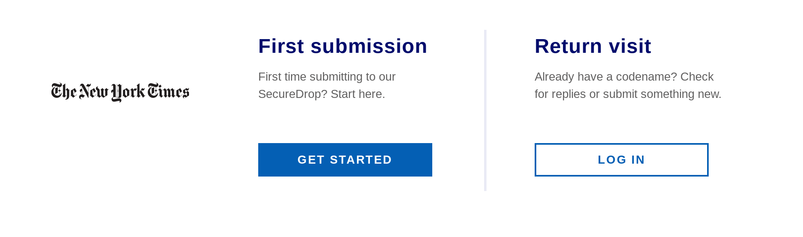

Using SecureDrop
===

SecureDrop was originally designed under the name and it aims to provide a secure way for whistleblowers to send documents to journalists and news agencies.

Many big news agencies around the world use SecureDrop. (such as The Intercept, The Guardian, The New York Times, ProPublica, etc.)

SecureDrop uses Tor network for anonymisation and security therefore SecureDrop sites are only accessible through onion sites.

Before sending any file to any organization, remember to scrub the metadata. If you're using Tails, there is a toolkit named "Metadata Anonymisation".

To use SecureDrop you should use public wifi networks and not use computers in a Internet café or those controlled by your employee. CCTV cameras and other people nearby can see what you're doing as well, so be cautious!

How to submit files through SecureDrop?
---

1. Connect to a wifi network that is not associated with you or your employer.

2. Use Tails or Tor Browser. (Tails provides better privacy)

3. Find SecureDrop link for the news agency you wish to communicate with. You can find the list of SecureDrops [here](https://securedrop.org/directory/)

4. Open the link and you will see a page like this.

5. Click on Get Started. You will receive a codename. This codename will be used to communicate with you. When you wrote it down or memorized it, click on 'SUBMIT DOCUMENTS'.

6. Here you will be able to submit files or messages. After uploading your files, click on "SUBMIT".

Things to consider
---

If your machine is compromised, your communication through SecureDrop may be compromised as well. Remember that being a whistleblower carries risks and there is no way to eliminate all risks.

Try to compartmentalize. Don't use your previous social media accounts, pre-existing email accounts, etc.

SecureDrop doesn't guarantee your anonymity. If you're trying to leak documents, your adversary will use your search history, visited websites, Signal or WhatsApp messages, and everything you left behind.

