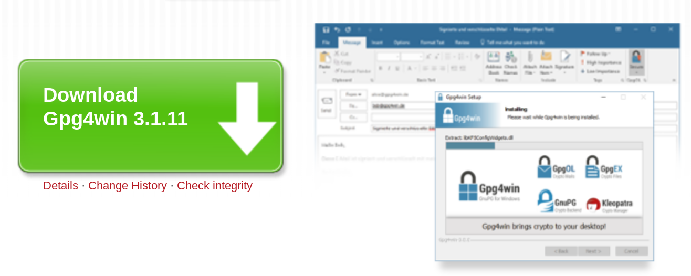

Installing PGP on Windows
=========================

Thunderbird now has a built-in support for OpenPGP so there is no need to install Enigmail which people had to install before to encrypt their emails in Thunderbird. All you need to have on your machine to start sending encrypted emails is to have GPG and Thunderbird. To get PGP to work with Thunderbird we need to install GPG - a free software implementation of PGP. Confused?! Don't worry about it, all you have to know is how to encrypt your email with PGP and you need to install GPG. Here is how to do it...

Installing PGP (GPG) on Microsoft Windows
-----------------------------------------

The GNU Privacy Guard (GnuPG) is software which is required to send PGP encrypted or signed emails. It is necessary to install this software before being able to do any encryption.

Head to the website of the Gpg4win project. Go to [http://gpg4win.org/](http://gpg4win.org/)

On the left side of the website, you will find a 'Download' link. Click on it.

This will take you to a page where you can download the Gpg4Win. Click on the button which offers you the latest stable version (not beta) of Gpg4Win.

This will download you an .exe file. Depending on your browser, you may have to double-click on this downloaded file (named something like `gpg4win-3.1.11.exe`) before something happens. Windows will ask you if you are sure you want to install this program. Answer yes. Before installing remember to check integrity of the downloaded installer.

Then complete the installation by agreeing to the license, choosing appropriate language and accepting the default options by clicking 'Next', unless you have a particular reason not to. 

The installer will ask you where to put the application on your computer. The default setting should be fine but make a note of it as we may need this later. Click on 'Next' when you agree.
 
 