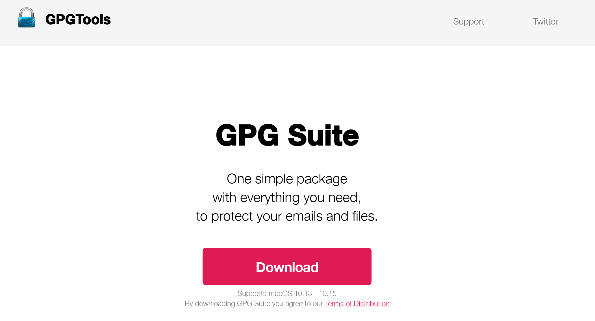
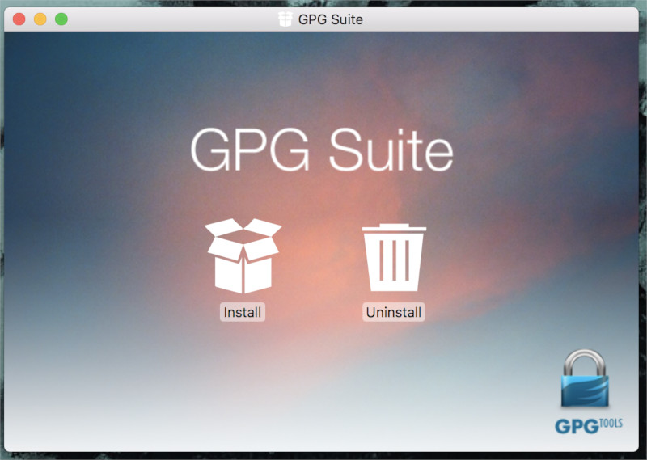
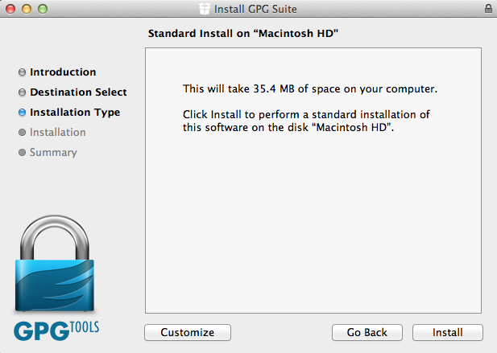
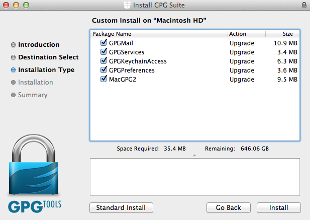
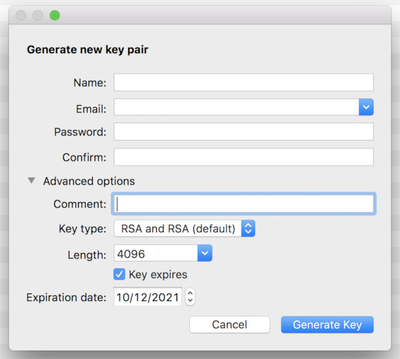

Installing PGP on macOS
=====================

The GNU Privacy Guard (GnuPG) is software which enables you to send PGP encrypted or signed emails. It is necessary to install this software before being able to do any encryption. This chapter covers the installation steps required to install GnuPG on macOS.

Getting started
---------------

To get started we need to have GnuPG, Mozilla Thunderbird on our device. Since Thunderbird now supports OpenPGP there is no need for Enigmail and their project is now obsolete.

Installing GPGTools
---------------------------------------

For macOS there is a bundle available which will install everything you need in one installation. You can get it by directing your browser to [http://www.gpgtools.org/](http://www.gpgtools.org/) 

Click on the "Download" button to download the installer.

Please make sure to verify the download before installing it. 

After the file is downloaded, double-click on it to mount the image.

Click on "Install" and a window will open up.

When you get to this window, click on "Customize"

You can select or de-select packages:

At the end of the installation process, a program will open and will ask you to create your first OpenPGP key.

Fill in the necessary details and click on "Generate Key" button.

Note: You can also create your first OpenPGP key using Enigmail.

