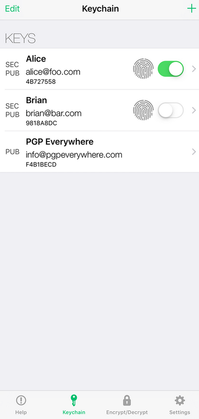
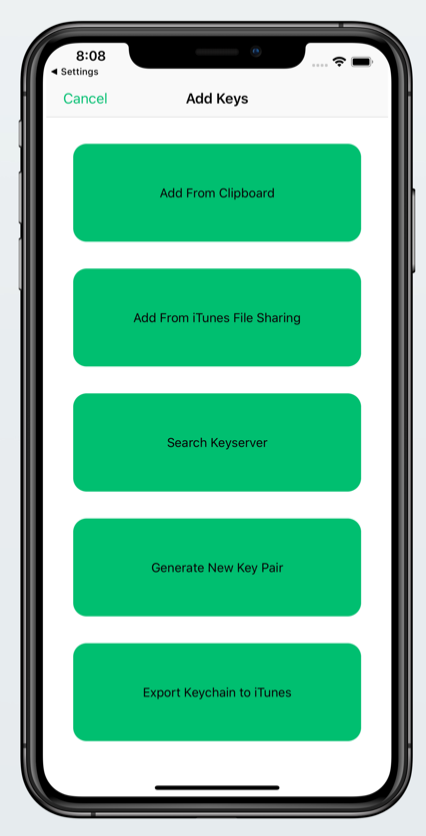

Installing GPG On iOS
===

Be aware that using a proprietary operating systems to encrypt/decrypt your messages is not recommended. It's also best to use a desktop computer or a laptop instead of a mobile device since mobile devices track your every movement so they can build a profile on you.

Also configuring a laptop or a computer to be more private is far easier than configuring a closed source system like iOS.

If you have no choice and you want to use an iOS device, we can name few options. Here are your options:

- [iPGMail](https://ipgmail.com/) (Proprietary)
- [PGPro](https://pgpro.app/) (Open Source)
- [PGP Everywhere](http://pgpeverywhere.com/) (Proprietary)

How to use PGP Everywhere
---

In order to use PGP Everywhere, you go to app store and search App Store and install the app. After the installation, launch the app and select the Keychain tab. Touch the "+" icon in the upper right corner.

Then Touch "Generate new key pair" to generate a new key pair. Follow the prompts to create a new key pair.

Congratulations! Now you have a key pair and you're ready to send encrypted emails.

Note: If you encounter any problem during setup or any other part visit PGP Everywhere's website at here: https://pgpeverywhere.customerly.help/

