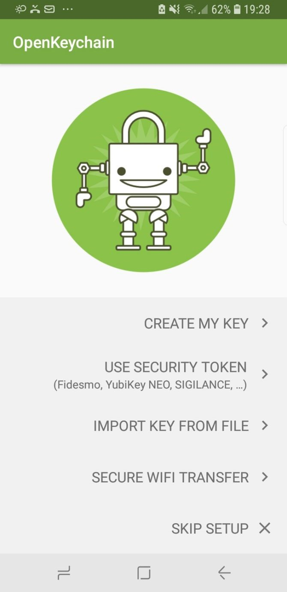

Installing GPG on Android
=========================

With the growing usage of mobile phones for e-mail, it's interesting to be able to use GPG also on your mobile. This way you can still read the messages sent to you in GPG on your phone and not only on your computer. Although it's not recommended to encrypt an email on your mobile. In this part we are going to discuss how to use [OpenKeychain](https://www.openkeychain.org/) on your android device to encrypt your emails. OpenKeychain is based on the well established OpenPGP and is open source.

How To use OpenKeychain
---

Go to Google Play Store and download OpenKeyChain.

Launch the app and select "Create My Key".

Enter your name.

Enter your email address.

Now you have to confirm your name and email address. Uncheck the Publish on keyservers option. After this select Create Key.

Congratulations! Now you're ready to send your first encrypted email.