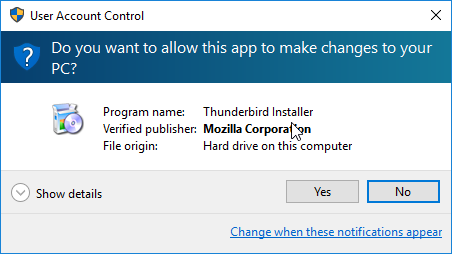

Using Thunderbird
--------------------------------------

Thunderbird now has a built-in support for OpenPGP so there is no need to install Enigmail which people had to install before to encrypt their emails in Thunderbird. All you need to have on your machine to start sending encrypted emails is to install Thunderbird. Here is how to do it...

Installing Thunderbird on Windows
--------------------------------------

Go to the Mozilla Thunderbird [website](https://www.mozilla.org/en-US/thunderbird/).

Click on “Free Download”. After that double-click on the setup file to run the installer.

User Account Control will ask you if you want to allow this app to make changes to your computer. Click the "yes" button.

 

Click the "Next" button.

 

Choose "Standard" and click the "Next" button.

 

Click "Install" to continue.

 

Now click "Finish" to close this wizard.

 

Installing Thunderbird on macOS
--------------------------------------

Go to the Mozilla Thunderbird [website](https://www.mozilla.org/en-US/thunderbird/).

 

Click on “Free Download”. After that double-click on the setup file to mount the image.

You will see a window like this:

 

Drag Thunderbird's icon to the Applications folder.

 

Now go to your Application's folder and launch Thunderbird for the first time.

macOS will ask you if you're sure you want to open this file. Click on "Open" button.

 

Now Thunderbird is ready for use. You can configure it to use any email you want.

Installing Thunderbird on Linux
--------------------------------------
### Using Software Center

We will use the Software Center to install Thunderbird. First open the Software Center  by typing 'software' into the search area:

Click on the 'Software Center'.

You will see a window like this:

 

Type “Thunderbird” into the Software search field and search results should be returned automatically:

 

Click 'Install' and you will be asked to authenticate the installation process.

 

Enter your password and click 'Authenticate'. The installation process will begin.

When the process is completed you get very little feedback from Ubuntu. The progress bar at the top left disappears. The 'In Progress' text on the right also disappears. Thunderbird should now be installed.

### Using Terminal

You also have the option to use a terminal instead of software center. On Ubuntu run this command to install Thunderbird:

	sudo apt install thunderbird

On Fedora:

	sudo dnf install thunderbird

Encrypting Emails
--------------------------------------

Follow these steps:

1. Launch Thunderbird 

2. Go to Tools > OpenPGP Key Manager

 

3. If you don't have a keypair, you create one by choosing Generate > New Key Pair

4. A window like this will open up. Select an identity and choose an expiration time and change the settings if you want to. Normally the default suffices.

 

5. Now you have a key pair and you're ready to write encrypted emails, Remember you must have a public key for every recipient.  Open the compose window and select Options > Require Encryption or the menu found on the security button and write your first encrypted email.

Getting the public keys of correspondents
--------------------------------------

Many people post their public key on their website or they ask you to email them so they can send it to you. 

Sometimes people upload their public key on key servers as well. If you can't find their public key on a key server it's because they haven't uploaded it. You shouldn't upload their public key without their consent, this is considered a bad behavior.

To find someone's public key, select Keyserver > Discover Keys Online and type your recipient's email address or their key ID.

 

Further Information 
--------------------------------------

To learn more about Thunderbird, read their documentation at: [https://support.mozilla.org/en-US/kb/openpgp-thunderbird-howto-and-faq](https://support.mozilla.org/en-US/kb/openpgp-thunderbird-howto-and-faq)