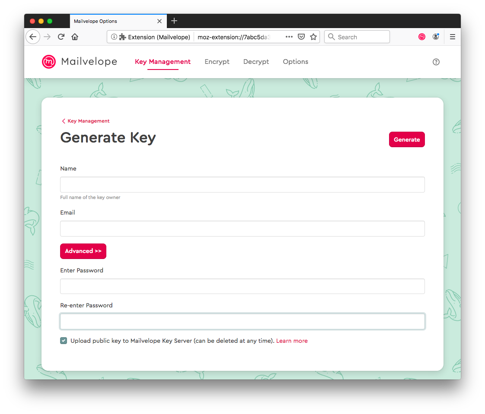
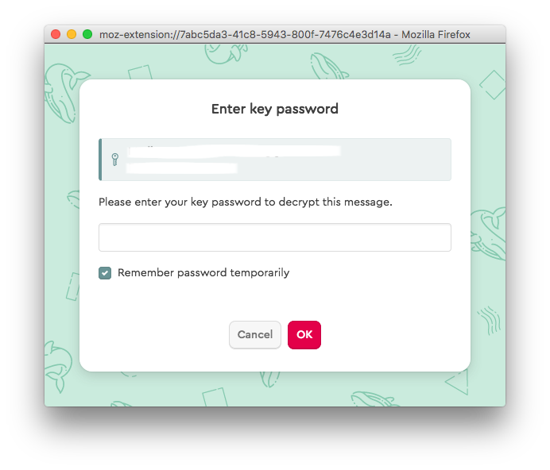
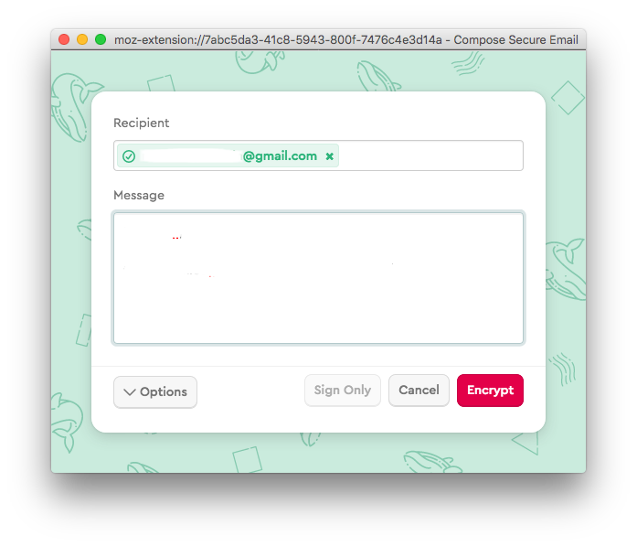

Using Mailvelope
===

Mailvelope is a browser add-on that lets you encrypt your emails with PGP using webmail providers.

Mailvelope is available for Chrome, Mozilla Firefox and Edge.

Installing Mailvelope
---

To install Mailvelope go to Mailvelope's website and select the appropriate add-on.

Once you answer the browser security questions during installation, Mailvelope will be installed and you will see the Mailvelope welcome page.

Configuring Mailvelope
---

To configure Mailvelope click on Mailvelope's icon.

You will be redirected to this page:

If you don't have a key pair, click on "Generate key" button. You'll see this:

Here you have to enter your real name (or a nickname), Email and a strong password.

You can select or de-select the option to upload your public key to Mailvelope's key server.

After clicking on the "Generate" button you'll see this notification:

Congratulations! Now you have your own key pair. Now go and verify the email address you used on the Mailvelope's key server. When you log in, you should see an email like this:

When you open the email, Mailvelope will recognize the content. After you click on the symbol, you'll have to enter your password.

Click on the link to verify your email address.

Your key is now verified!

How To Use Mailvelope
---

Open a new email in your webmail, in this case we're using Gmail.

In order to write an encrypted mail, click on Mailvelope's icon. Now compose your email.

When you enter your recipient's email it will either turn green or not. If it turns green it means that your recipient has installed and configured Mailveope. If it doesn't turn green it could mean that the recipient's address is not yet available on the Mailvelope's key server.

After you're finished, click on "Encrypt".

Be aware that PGP does not encrypt your subject line. When you're ready, click on "Send".

Congratulations! Now you've sent your first encrypted email.