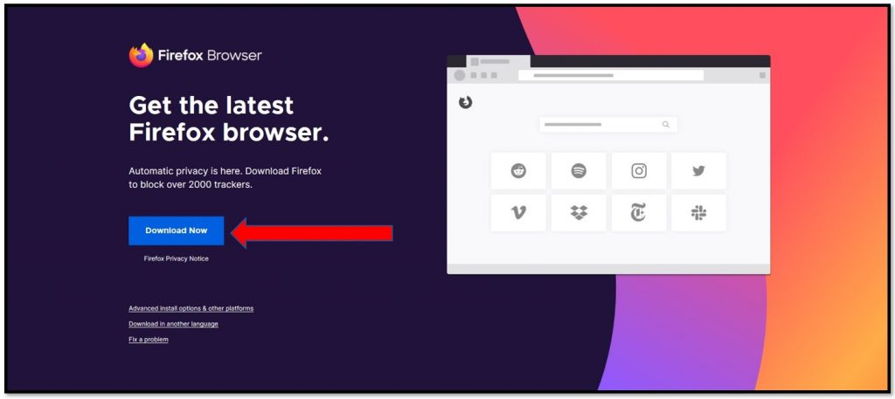

Installing on macOS
======================

 1. To download Firefox, visit [Firefox download page](https://www.mozilla.org/en-US/firefox/new/) and click the download button.

  

 2. When download is finished, the file should open by itself and pop open a Finder window containing the Firefox application.  Click and drag the **Firefox** icon on top of the **Applications** icon.

 

 4. After dragging Firefox to the Applications folder, hold down the control key while clicking in the window and select Eject "Firefox" from the menu. 

 
 6. Now for easy access, open the **Applications** directory and drag the **Firefox** icon to your dock:

Congratulations, you are now ready to use Firefox!

