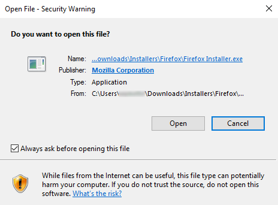
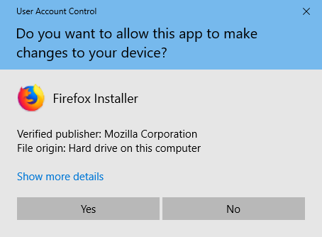
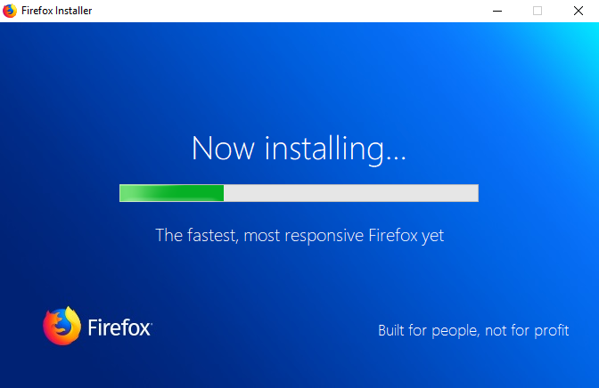
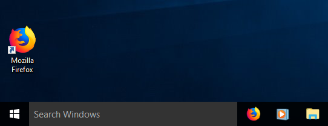

Installing Firefox on Windows
=============================

1. To download Firefox, visit [Firefox download page](https://www.mozilla.org/en-US/firefox/new/) and click the download button.

2. Click the download button and the installation file will begin to download to your computer.

 

3. Once the download is complete, double-click the installation file to start the Firefox installation wizard.

 **Note**: If you see a dialog like this, click on run:

 

4. After that a dialog like this might appear, click yes to start the installation.

 

5. Wait for the installation to finish.

 

Congratulations, you are now ready to use Firefox!

