Extending Firefox
=================

When you first download and install Firefox, it can handle basic browser tasks immediately. You can also add extra capabilities or change the way Firefox behaves by installing add-ons, small additions that extend Firefox's power.

Firefox extensions can pimp your browser, but they can also collect and transmit information about you. Before you install any add-on, keep in mind to choose add-ons from trusted sources. Otherwise, an add-on might share information about you without your knowing, keep a record on the sites you have visited, or even harm your computer.

There are several kinds of add-ons:

 * *Extensions* add functionality to Firefox
 * *Themes* change the appearance of Firefox.
 * *Plugins* help Firefox handle things it normally can't process (i.e. Flash content, Java applications).

For the topics covered in this book we are only going to need extensions. We will look at some add-ons that are particularly relevant for dealing with Internet security. 

**CAUTION:** We recommend that you never install an add-on for Firefox unless it is available from the Firefox add-on webpage. You should also never install Firefox unless you get the installation files from a trusted source. It is important to note that using Firefox on someone else's computer or in an Internet caf increases your potential vulnerability.

While no tool can protect you completely against all threats to your online privacy and security, the Firefox extensions described in this chapter can significantly reduce your exposure to the most common ones.

HTTPS Everywhere
----------------

HTTP is considered unsafe, because communication is transmitted in plain text. Many sites on the Web offer some support for encryption over HTTPS, but make it difficult to use. For instance, they may connect you to HTTP by default, even when HTTPS is available, or they may fill encrypted pages with links that go back to the unencrypted site. The HTTPS Everywhere extension fixes these problems by rewriting all requests to these sites to HTTPS. Although the extension is called "HTTPS Everywhere", it only activates HTTPS on a particular list of sites and can only use HTTPS on sites that have chosen to support it. It cannot make your connection to a site secure if that site does not offer HTTPS as an option.

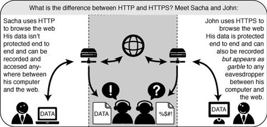

Please note that some of those sites still include a lot of content, such as images or icons, from third party domains that is not available over HTTPS. As always, if the browser's lock icon is broken or carries an exclamation mark, you may remain vulnerable to some adversaries that use active attacks or traffic analysis. However, the effort required to monitor your browsing should still be usefully increased.

Some websites (such as Gmail) provide HTTPS support automatically, but using HTTPS Everywhere will also protect you from TLS/SSL-stripping attacks, in which an attacker hides the HTTPS version of the site from your computer if you initially try to access the HTTP version.

Additional information can be found at: [https://www.eff.org/https-everywhere](https://www.eff.org/https-everywhere).

Installation
------------

First, download the HTTPS Everywhere extension from [EFF's official website](https://www.eff.org/https-everywhere).

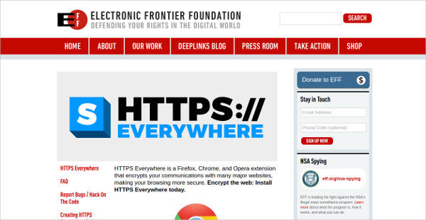

Click on Firefox logo to install HTTPS Everywhere.

Click on "Continue to installation". You will then have to click on "Add". HTTPS Everywhere is now installed.

Configuration
-------------

To configure HTTPS Everywhere click on HTTPS Everywhere's icon.

From here you can view all rules and change settings.
If you want to completely block any unencrypted requests, check the Block all unencrypted requests box. The HTTPS Everywhere extension icon changes from blue to red.

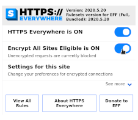

After this, HTTPS Everywhere's icon will become red.

Usage
-----

Once enabled and configured, HTTPS Everywhere is very easy and transparent to use. Type an insecure HTTP URL (for example, [http://www.google.com/](http://www.google.com/)).

Press Enter. You will be automatically redirected to the secure HTTPS encrypted Web site (in this example: [https://www.google.com/](https://www.google.com/)). No other action is needed.

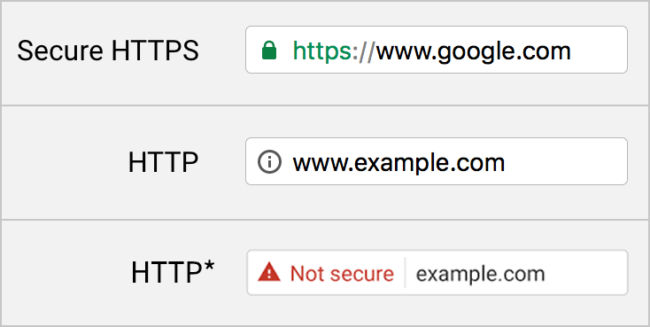

If networks block HTTPS
-----------------------

Your network operator may decide to block the secure versions of Web sites in order to increase its ability to spy on what you do. In such cases, HTTPS Everywhere could prevent you from using these sites because it forces your browser to use only the secure version of these sites, never the insecure version. (For example, we heard about an airport WiFi network where all HTTP connections were permitted, but not HTTPS connections. Perhaps the WiFi operators were interested in watching what users did. At that airport, users with HTTPS Everywhere were not able to use certain Web sites unless they temporarily disabled HTTPS Everywhere.)

In this scenario, you might choose to use HTTPS Everywhere together with a circumvention technology such as Tor or a VPN in order to bypass the network's blocking of secure access to Web sites.

Adding support for additional sites in HTTPS Everywhere
-------------------------------------------------------

HTTPS Everywhere already comes with thousands of rulesets that tell HTTPS Everywhere which sites it should switch to HTTPS. You can add your own rules to the HTTPS Everywhere add-on for your favorite Web sites. You can find out how to do that at: [https://www.eff.org/https-everywhere/rulesets](https://www.eff.org/https-everywhere/rulesets). The benefit of adding rules is that they teach HTTPS Everywhere how to ensure that your access to these sites is secure. But remember: HTTPS Everywhere does not allow you to access sites securely unless the site operators have already chosen to make their sites available through HTTPS. If a site does not support HTTPS, there is no benefit to adding a ruleset for it.

If you are managing a Web site and have made an HTTPS version of the site available, a good practice would be to submit your Web site to the official HTTPS Everywhere release.

uBlock Origin 
------------

[uBlock Origin](https://addons.mozilla.org/en-US/firefox/addon/ublock-origin/) is s a free and open-source, cross-platform browser extension for content-filtering, including ad-blocking.

uBlock Origin blocks ads through its support of the Adblock Plus filter syntax. uBlock Origin extends the syntax and is designed to work with custom rules and filters. 

Furthermore, advanced mode allows uBlock Origin to work in default-deny mode, which mode will cause all 3rd-party network requests to be blocked by default, unless allowed by the user.

In comparison to other ad blockers, uBlock Origins is easier on your CPU and memory.

Installing uBlock Origin
---------------------------------

Once you have Firefox installed:

 1. Download the latest version of uBlock Origin from the Firefox Add-ons web site.
 2. Confirm that you want to install uBlock Origin.
 3. uBlock Origin is now installed.
 
**Note**: It's advised not to use uBlock Origin with other content blockers (such as Adblock Plus, AdBlock) at the same time. Other blockers can also prevent uBlock Origin's privacy or anti-blocker-defusing features from working properly.

Usage
------------------------------

uBlock Origin uses these filters straight out of the box:

- EasyList
- Peter Lowe’s Ad server list
- EasyPrivacy
- Malware domains

There are more lists available if you want to load and enforce them. These lists include:

- Fanboy’s Enhanced Tracking List
- Dan Pollock’s hosts file
- hpHosts’s Ad and tracking servers
- MVPS HOSTS
- Spam404
- And many others

**Note**: The more filters you use the more amount of memory and cpu you'll use. Also using more lists may lead to site breakage.

To enable/disable uBlock Origin for the current website, click on the big power button. Keep in mind that this feature only enables/disables uBlock Origin for the current website not for all websites.

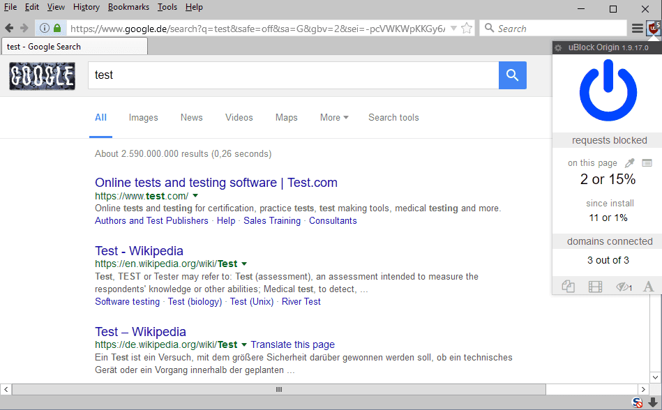

To modify uBlock Origin's functionality click on Settings and tick the box next to “I am an advanced user.”
Ticking this box allows you to adjust blocking settings.

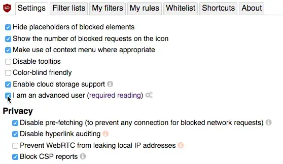

**Note**: Remember to tick "Prevent WebRTC" from leaking local IP Address. 

If we were on [cnn.com](https://cnn.com), uBlock Origin would look like this:

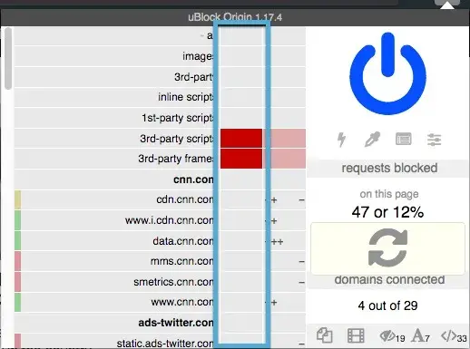

We can see three columns, in the first column we see where the content originates from.

For example you can see "ads.twitter.com" o "smetrics.cnn.com"

Second column indicates global rules and third column indicates local rules.

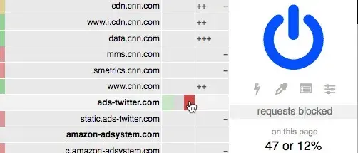

Each box has three colors: Green, Gray and Red. 

- Green: Corresponding element is permited. 
- Gray: No operation.
- Red: Corresponding element is blocked.

Other symbols used:

- Plus icon indicates that content from that URL is being permitted
- Minus icon indicates that content from the URL is being blocked.

You can sometimes see a mixture of pluses and minuses for one URL, which indicates that some of the content is permitted while other content is blocked.

You can also look at the color coding next to the URL. Green indicates that content from that URL is permitted. Yellow indicates that some content from that URL is blocked. Red indicates that all content from the URL will be blocked.

When you change a filtering rule, it will remain changed temporarily. If you wish to make it permanent, click the lock icon.

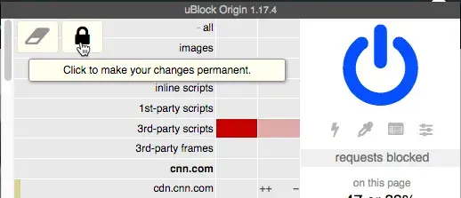

To revert your change click the eraser icon.

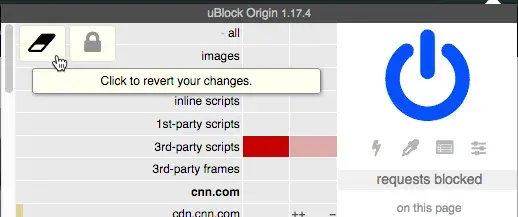

Using Custom Filter Lists
-----------------------------------------------
One way you can find more filter lists is to look at [FilterLists](https://filterlists.com/).
FilterLists provides a comprehensive directory of subscription lists to block advertisements, malware, trackers, and other general annoyances.

If you find a list that you wish to use, click "Details" and then click "Subscribe". This action will download and include  the list in uBlock Origin’s blocking rules.

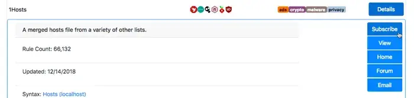

To see these filter lists you have to go to your settings under "Filter lists" tab.

Other tools that can improve your security
-----------------------------------------------

Below is a short list of extensions that are not covered in this book but are helpful to further protect you.

 * **NoScript** - Although not friendly for beginners, this addon will block scripts and third party plugin content (eg, Adobe Flash) unless specifically allowed by the user, it also provides general protection against simple cross site scripting vectors. [https://noscript.net/](https://noscript.net/)

 * **CanvasBlocker** - This add-on allows users to prevent websites from using some Javascript APIs to fingerprint them. Users can choose to block the APIs entirely on some or all websites (which may break some websites) or just block or fake its fingerprinting-friendly readout API. [http://noscript.net/](http://noscript.net/)
 
 * **Temporary Containers** - Temporary Containers allow you to open tabs, websites, and links in automatically managed disposable containers. Containers isolate data websites store (cookies, storage, and more) from each other, enhancing your privacy and security while you browse. [https://addons.mozilla.org/firefox/addon/temporary-containers/](https://addons.mozilla.org/firefox/addon/temporary-containers/)
 
 * **Decentraleyes** - Protects you against tracking through “free”, centralized, content delivery. It prevents a lot of requests from reaching networks like Google Hosted Libraries, and serves local files to keep sites from breaking. Complements regular content blockers.
 [https://decentraleyes.org/](https://decentraleyes.org/)
 
 
 * **User-Agent Switcher and Manager** - This add-on allows you to change your user-agent. [https://addons.mozilla.org/en-US/firefox/addon/user-agent-string-switcher/?src=search](https://addons.mozilla.org/en-US/firefox/addon/user-agent-string-switcher/?src=search)