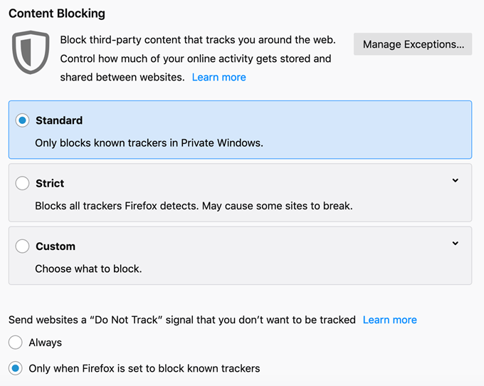
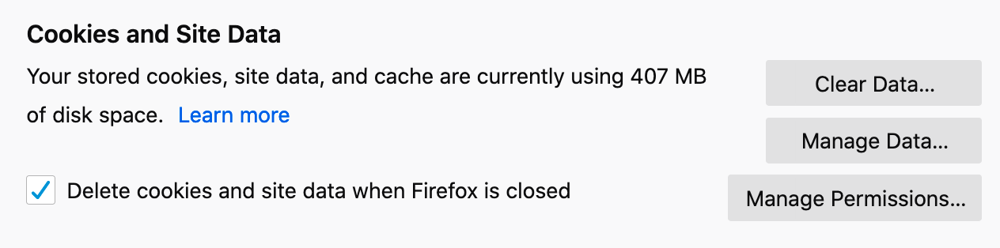
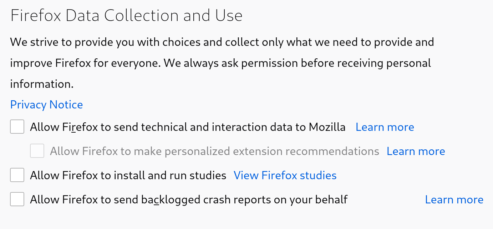
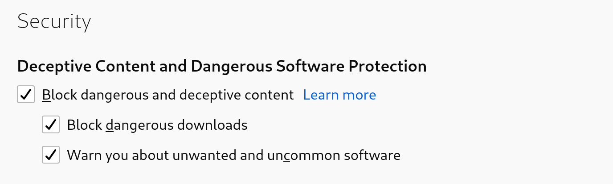
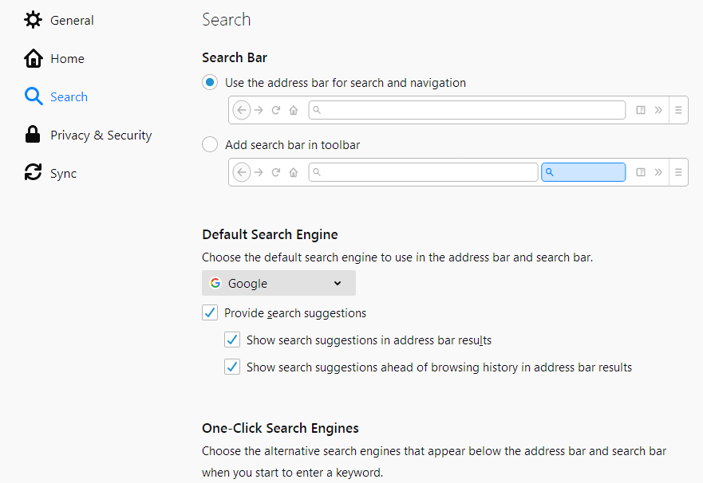
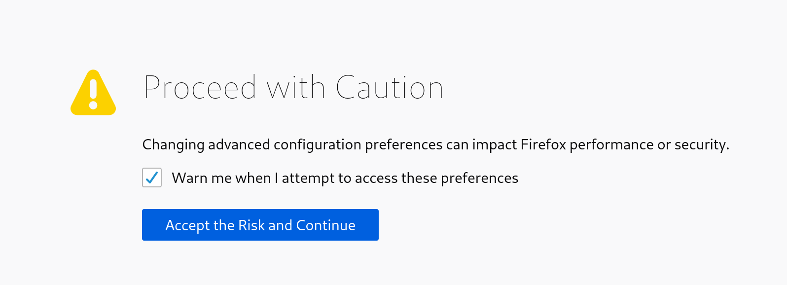
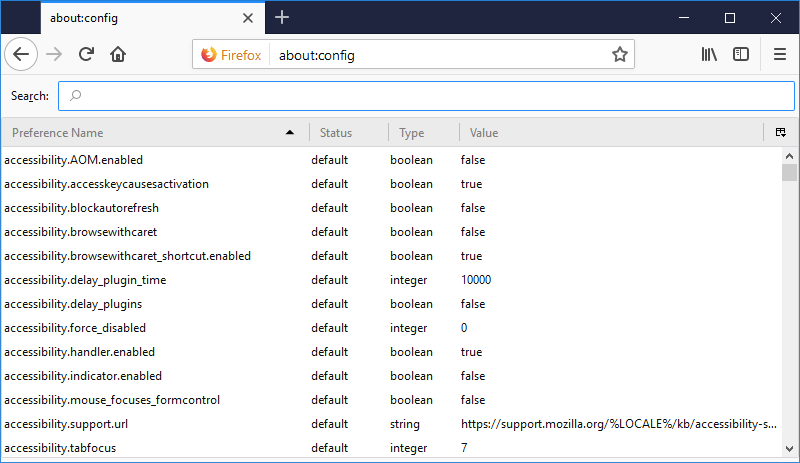
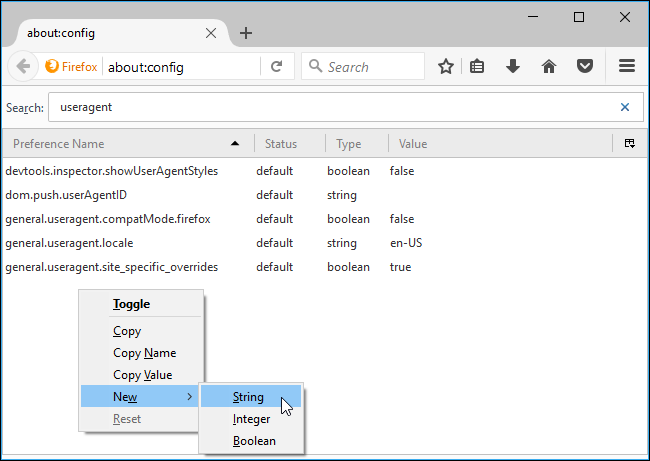
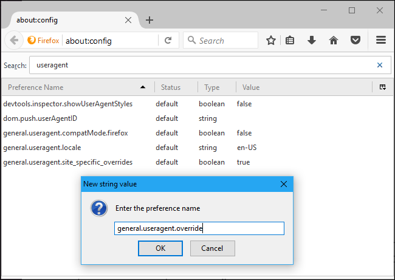

Tweaking Firefox
=================

Since Firefox is highly configurable and we took advantage of this to add more extensions, we should also use this feature to tweak our configurations to harden our browser too. Our aim in this chapter is to enhance our browser's privacy and security. 

Firefox Content Blocking
------------

You can automatically set Firefox to block cookies, trackers, cryptominers and fingerprinters. To do this go to Menu > Options > Privacy and Security > Content Blocking

You have three options: Standard, Strict and Custom. Choosing Strict may cause some sites to break but it offers more protection.

Clearing Cookies and Site Data
------------

It's very important to remove your cookies everytime you close your browser. Cookies are small files that are written on your computer and they track you wherever you go to understand your browsing habits. If you want to be private, you should always remember to delete these files.

Changing Privacy Settings
------------

Next scroll down to Firefox Data Collection and Use. Uncheck all three categories for Telemetry, Crash Reporter, and Mozilla Location Service.

Security
------------

Next scroll down to Security. Here you can see few check boxes, check them all.

Change default search engine
------------

To change your search engine, follow these steps:

1. Click the menu button  and select Preferences.

2. Select Search in the left pane. 

  

3. Use the drop down menu under Default Search Engine to choose the search engine you wish to use by default. 

You can also install your search engine's add-on from Firefox's add-on page to change your search engine.

About:Config
------------

We've covered a lot of ground. Now it's time to make some modifications using about:config

To do this open a new tab and type about:config into the url bar. You might see a warning that says: "Proceed with Caution"	

Click "Accept the Risk and Continue" to continue.

Now you will see a page like this:

 

Now we need to change some preferences, to change a preference you have to double-click on it.

Changing user agent
---

Although you can install an add-on to change your user agent, It's not difficult to override your user agent in about:config. All you have to do is to look for this preference: general.useragent.override

If it doesn't exist on your system, try creating a new preference with this name. To do this right click on the about:config page > New > String.

Enter the preference name:

Then enter your desired user agent as the value of the preference. For example here is a user agent string:

	Mozilla/5.0 (iPhone; CPU iPhone OS 7_0 like Mac OS X) AppleWebKit/546.10 (KHTML, like Gecko) Version/6.0 Mobile/7E18WD Safari/8536.25

This setting applies to every open tab and persists until you change it, even if you close and reopen Firefox.

Disable WebRTC
---

Although uBlock Origin allows you to disable WebRTC you could also modify your config to disable WebRTC:

media.peerconnection.enabled: false

media.peerconnection.use\_document_iceservers: false 

Enable Do Not Track
---
privacy.donottrackheader.enabled: true

privacy.donottrackheader.value: 1

privacy.trackingprotection.enabled: true 

Disable sending pings
---
browser.send_pings: false

browser.sendpings.require\_same_host: true 

Disable geolocation
---
geo.enabled: false

geo.wifi.uri: (blank) 

Disable geotargeting
---
browser.search.geoSpecificDefaults: false

browser.search.geoSpecificDefaults.url: (blank)

browser.search.geoip.url: (blank) 

Disable telemetry
---
toolkit.telemetry.enabled: false

toolkit.telemetry.server: (blank) 

Disable 'safe browsing' aka. Google tracking/logging
---
browser.safebrowsing.downloads.enabled: false

browser.safebrowsing.downloads.remote.enabled: false

browser.safebrowsing.enabled: false

browser.safebrowsing.maleware.enabled: false 

Disable DNS prefetch
---
network.dns.disablePrefetch: true 

Disable prefetching of pages that are likely to be visited
---
network.prefetch-next: false 

Disable WebGL
---
webgl.disabled: true 

Disable the internal PDF reader
---
pdfjs.disabled: true 

Other preferences
---
network.cookie.cookieBehavior = 1

network.http.referer.XOriginPolicy = 2

browser.sessionstore.privacy_level = 2

media.navigator.enabled = false

dom.event.clipboardevents.enabled = false

browser.urlbar.speculativeConnect.enabled = false

privacy.firstparty.isolate = true

media.gmp-widevinecdm.enabled = false

media.eme.enabled = false

beacon.enabled = false

network.IDN\_show_punycode = true

network.http.referer.XOriginTrimmingPolicy = 2

**Final note**: Be aware that changing these preferences and adding more add-ons will make you stand out from others and it may be easier to identify you. To see how unique you are, you can use these tools:

- [https://panopticlick.eff.org ](https://panopticlick.eff.org )
- [https://amiunique.org/](https://amiunique.org/)
- [https://browserleaks.com/](https://browserleaks.com/)

