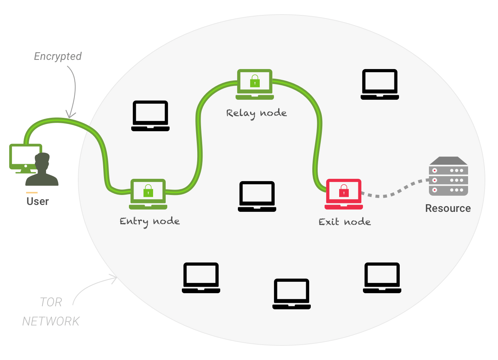
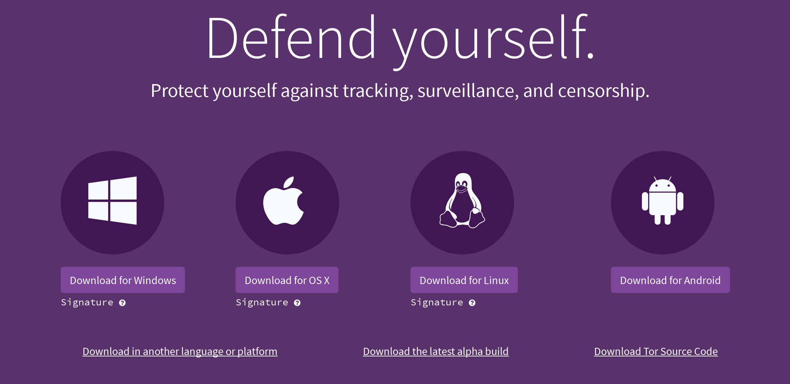
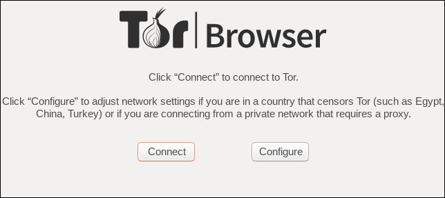
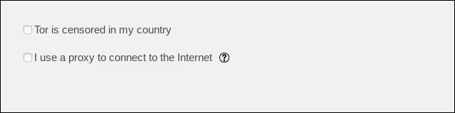
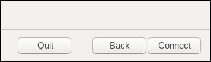
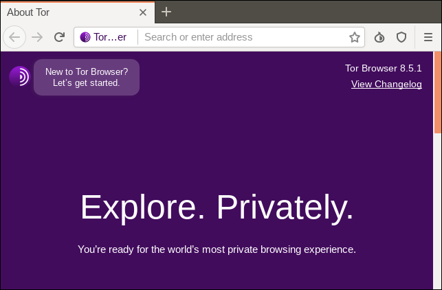
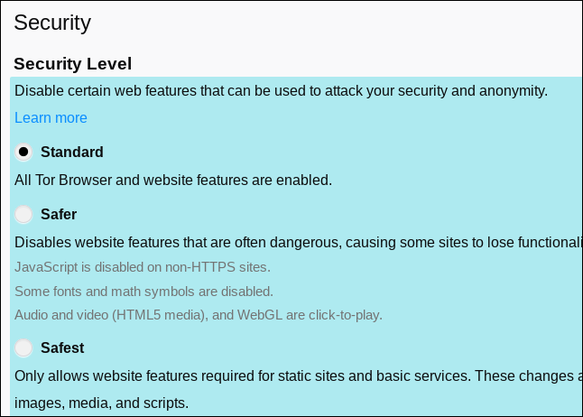

Using Tor
==========

Tor is a free software intended to enable anonymous communication, composed of client software and a network of servers which can hide information about users' location and other factors which might identify them. Imagine a message being wrapped in several layers of protection: every server is only able to take off one layer, thereby immediately deleting the sender information of the previous server.

If Alice wants to view Bob's website, instead of directly talking to Bob like this:

    Alice -> Bob
    
This is fine, and Alice and Bob can use end to end cryptography to ensure privacy, integrity and authenticity of their communications, however if Alice does not want Bob to know that she is viewing his website or does not want Eve (a hypothetical evesdropper, on Alice or Bobs side of the connection) to know she and Bob are communicating, extra steps must be taken.

Alice instead makes an encrypted connection to an EntryNode on the Tor network, here they establish a TLS connection and the EntryNode allows Alice to make a further connection through it. Once again a TLS connection is established this time through the already encrypted EntryNode connection, and once again the process is repeated through the RelayNode to the ExitNode. Now, Alice is encrypting the data 3 times, first for the ExitNode, then for the RelayNode and finally for the EntryNode. Creating a network path like this:

    Alice -> EntryNode -> RelayNode -> ExitNode -> Bob
    

When the EntryNode receives Alice's data it is still encrypted for the RelayNode and ExitNode, it knows where the data is coming from but not the final destination or the message content, it then passes the data on to the RelayNode. The RelayNode receives the data but it is still encrypted for the ExitNode, it knows it is coming from the EntryNode and going to the ExitNode but does not know the final destination or the original sender, it then passes the data to the ExitNode which removes the final layer of encryption, the ExitNode knows what the message is, that it came from RelayNode but does not know where it entered the network, or who sent it.

This layered approach is where Tor derives it's name from (The Onion Router), each 'layer' knows only of the layer on either side of it, meaning that none in the chain except Alice knows the full path the data is taking, however Alice, Bob and the ExitNode are all able to see the message content, thus end-to-end cryptography is still required to ensure privacy, integrity and authenticity of the communications across the Tor network.

Use of this system makes it more difficult to trace internet traffic to the user, including visits to Web sites, online posts, instant messages, and other communication forms. It is intended to protect users' personal freedom, privacy, and ability to conduct confidential business, by keeping their internet activities from being monitored. The software is open-source and the network is free of charge to use.

Like all current low latency anonymity networks, Tor cannot and does not attempt to protect against monitoring of traffic at the boundaries of the Tor network, i.e., the traffic entering and exiting the network. While Tor does provide protection against traffic analysis, it cannot prevent traffic confirmation (also called end-to-end correlation)

Caution: As Tor does not, and by design cannot, encrypt the traffic between an exit node and the target server, any exit node is in a position to capture any traffic passing through it which does not use end-to-end encryption such as TLS. (If your postman is corrupt he might still open the envelope and read the content). While this may or may not inherently violate the anonymity of the source, if users mistake Tor's anonymity for end-to-end encryption they may be subject to additional risk of data interception by third parties. So: the location of the user remains hidden; however, in some cases content is vulnerable for analysis through which identifying or revealing information about the user may be gained.

How To Download Tor Browser
------------------------------

First go to [Tor Project's website](https://www.torproject.org/download/) and download the latest release for your device.

If you're unable to download Tor Browser from the official Tor Project website because it's blocked in your country, you can instead try downloading it from one of official mirrors, either through [EFF](https://tor.eff.org/), [Calyx Institute](https://tor.calyxinstitute.org/) or [CCC](https://tor.ccc.de/).

You can also get Tor Browser by sending an email to gettor@torproject.org

To get the appropriate file, write the name of your OS in the body of the message. For example: “windows”, “osx”, or “linux” (without quotation marks).

You will receive an email that contains links from which you can download Tor Browser.

After downloading Tor Browser check the integrity of file by verifying Tor Browser's signature. For more information look at this page: [https://support.torproject.org/tbb/how-to-verify-signature/](https://support.torproject.org/tbb/how-to-verify-signature/)

How to Install Tor Browser
------------------------------

After downloading Tor Browser and verifying it's signature, it's time to run Tor Browser for the first time.
The file you download from Tor Project's website is a tar.xz file. We need to uncompress and untar it so that we can use its contents.

To do this run this command:

	tar -xvJf tor-browser-*.tar.xz

Now navigate to Tor Browser's folder and run this command:

	./tor-browser_en-US/Browser/start-tor-browser &

How to Configure the Tor Browser
------------------------------

If it's your first time using Tor Browser, you will see a dialog like this:

If you're using a proxy or Tor is censored in your country click on configure.

You will see two boxes like this:

By checking Tor is censored in my country, you can choose a bridge from the dropdown menu:

You also have the option to provide a bridge you already know, you can request a bridge from Tor Project too. You can use this page to get a bridge:
[https://bridges.torproject.org/](https://bridges.torproject.org/)

You can configure your proxy as well too. Just check I use a proxy to connect to the Internet and complete the field.

After that you're ready to go. Just click the "Connect" button and Tor will start.

Tor Browser's main window will look like this.

If you want maximum security, it's best to change your security's level to safest. You can do this by clicking on shield icon. Then change your security level. Safest will disable JavaScript therefore it may break many sites but it provides much better security than Standard.

Change Your Habits
-------------------------

While Tor Browser itself is very secure and protects you against many threats, you need change some of your habits, for example:

1. If you download a document from the internet, don't open it while Tor is open. 

2. Remember to not install any add-ons. This may lead to a more unique fingerprint. 

3. Do not click on suspicious links.

4. Don't visit HTTP websites. 

5. Make sure JavaScript is disabled. JavaScript can be used to deanonymize tor users. Allowing JavaScript will open the surface attack for attacks. To make sure Javascript is disabled you change your security level or simply go to about:config and set 'javascript.enabled' to 'false'.

Running a Relay or Bridge
-------------------------

Tor is a network of volunteers who run relays and bridges.  If you would like to grow the Tor network by contributing bandwidth and spare CPU cycles, consider running a relay.  Plus, running a relay may improve your anonymity since an attacker can't distinguished between traffic that originated from you or from the relay.  See the [Tor FAQ](https://www.torproject.org/docs/faq.html.en#BetterAnonymity) for more details.

However, if you do run a relay, your IP address will be listed on the Internet as a Tor relay.  Tor clients depend on this list, provided by Tor Directory Servers, so that they can build circuits.  If you wish to contribute to Tor, but do not want to run a public relay, consider running a bridge.  Since Tor relays are public, some ISP block access to the Tor network by blocking *all the relays.*  Tor Bridges are unlisted are therefore, more difficult to find.

Tor's goal is to protect anonymity on the Internet, but sometimes Tor is used for illegal purposes.  As a relay operator, consult the [Legal FAQ](https://www.torproject.org/eff/tor-legal-faq.html), written by the Electronic Frontier Foundation (EFF).  The EFF is a U.S. based non-profit organization whose mission is to "protect your digital right."  Other countries should seek the advice of similar organizations.  However, legal risks can be minimized by running a non-exit relay or bridge.

If you'd like to configure your computer to run a relay or a bridge, visit the [Tor website](https://www.torproject.org/docs/tor-doc-relay.html.en) for thorough instructions.
