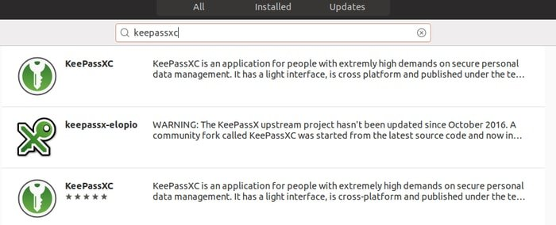
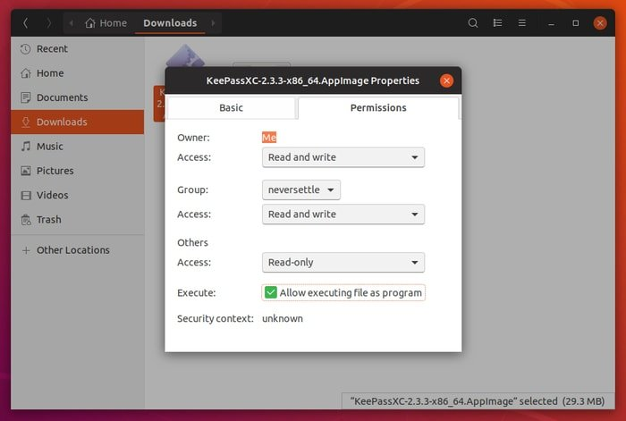
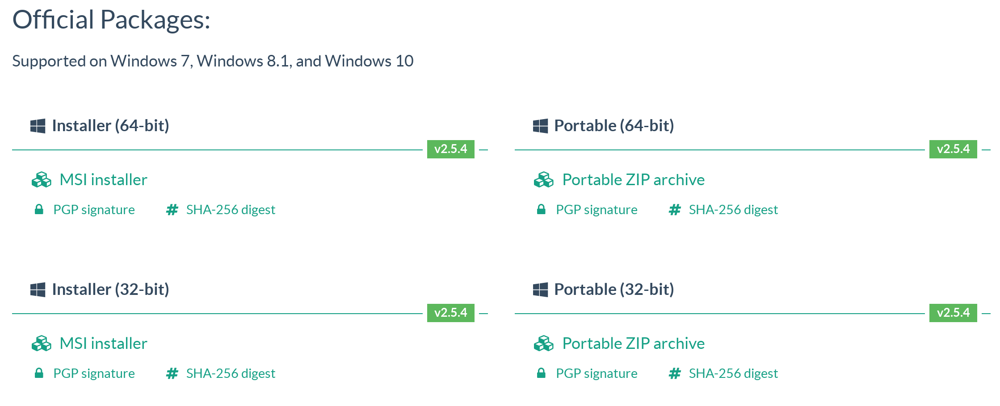
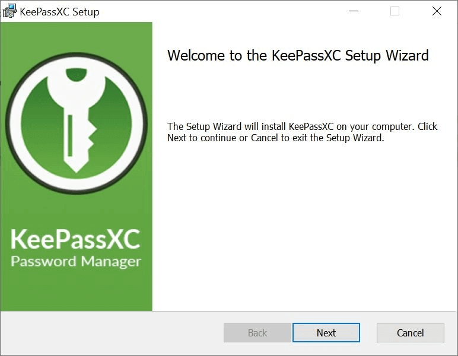
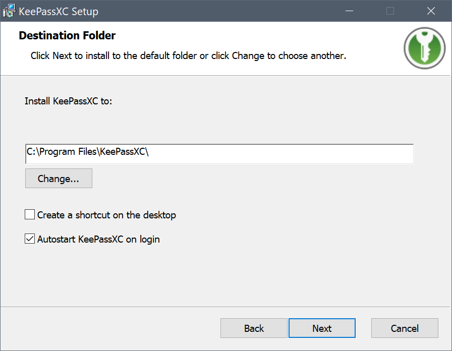
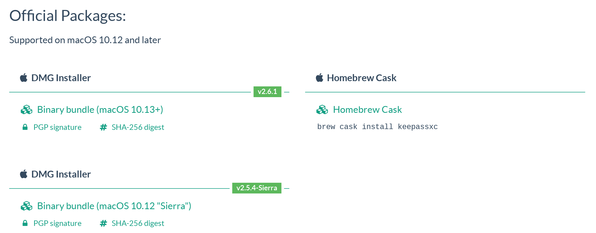
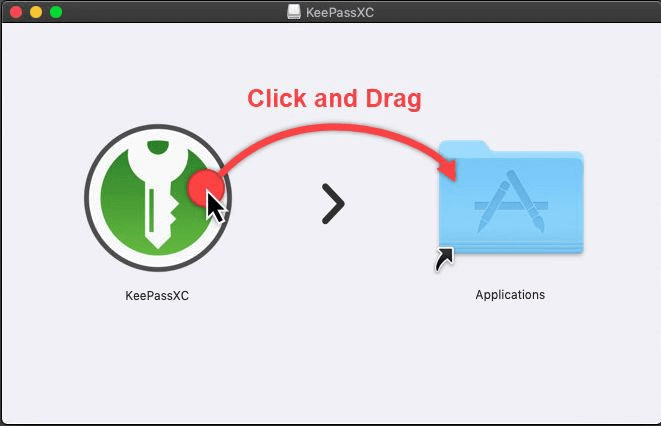
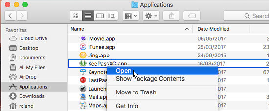
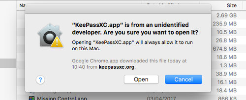

Installing KeePassXC
==================

We will cover installing KeePassXC on Linux, macOS and Windows. macOS already comes with a password manager called Keychain. Downsides are that it isn't open source and doesn't work on other systems. If you'd need to take your passwords from one operating system to another it is better to stick with KeePassXC after all.

The database you crerate is encrypted with either AES256 or the Twofish block cipher and the master password is resistant against brute force attacks. Additionally, you can use a key file filled with an arbitrary number of random bytes or a YubiKey to further enhance your master key. 

Installing KeePassXC on Linux
-----------------------------

To install on Linux we will use the Software Center. Type KeePassXC in the search field at the top right and the application KeePassXC should automatically appear in the listing. 

Choose KeePassXC and click Install.

You can also download the AppImage from KeePassXC's download page. Then you have to make this file executable by changing permissions. You can do this by following Properties -> Permissions -> Check Executable box.

An alternate way to achieve this is to use this command:

	chmod +x KeePassXC-*.AppImage

Before using KeePassXC, verify the signature to make sure it's the original file from KeePassXC.

Installing KeePassXC on Windows
-----------------------------

KeePassXC's download webpage [https://keepassxc.org/download/](https://keepassxc.org/download/) and choose the appropriate installer.

The installer is signed by DroidMonkey Apps, LLC. If your installer shows another publisher instead of this, click No and go to KeePassXC's website and download the official installer again.

When the installer is downloaded, double-click on it and you will see a window like this:

Click Next and follow the instructions to complete the installation. You can also choose whether you want to have a shortcut or auto-start KeePassXC on login.

Once you do that, KeePassXC is installed on your device. Before using KeePassXC, verify the signature to make sure it's the original file from KeePassXC.

Installing KeePassXC on macOS
------------------------------

Although Keychain in macOS does an excellent job of storing your passwords, you may want to run your own password database and manager. KeePassXC allows this added flexibility. First go to KeePassXC's download webpage [https://keepassxc.org/download/](https://keepassxc.org/download/) and choose the appropriate installer.

Open the dmg file and drag the app to the Applications folder.

The first time you run KeePassXC, do not double click it because it will not work due to macOS security restrictions. macOS just says it is an unknown app and therefore will not run it. The first time KeePassXC is run, Ctrl+click it and select Open.

A message appears and clicking Open runs the app.

Now KeePassXC is ready to use for macOS. Before using KeePassXC, verify the signature to make sure it's the original file from KeePassXC.
