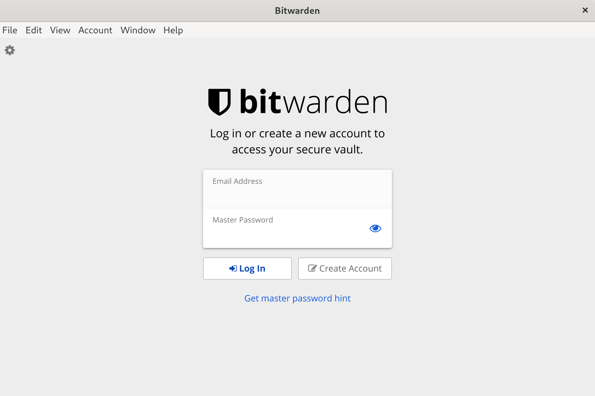
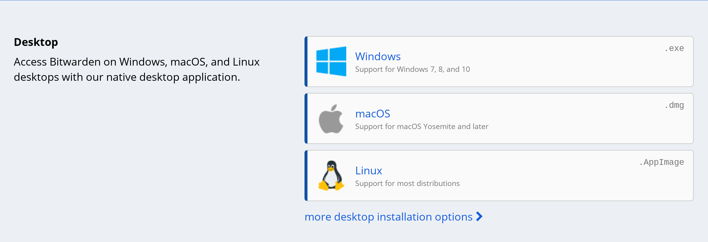
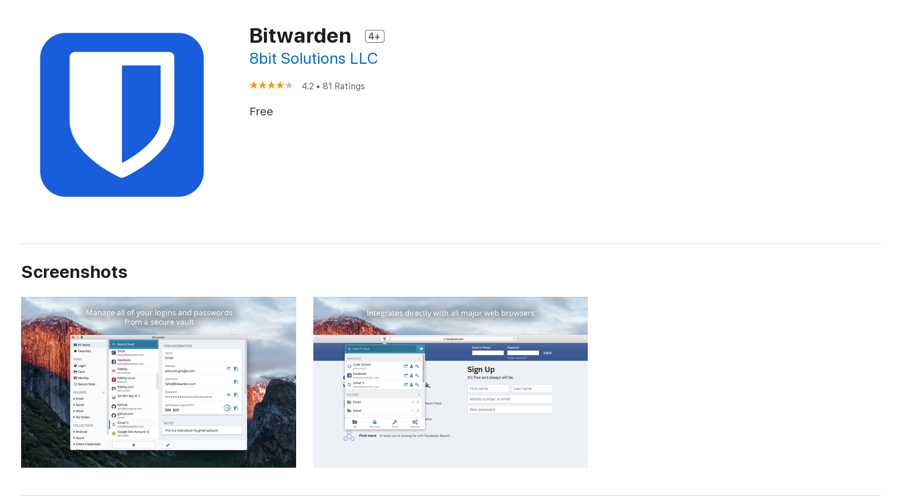
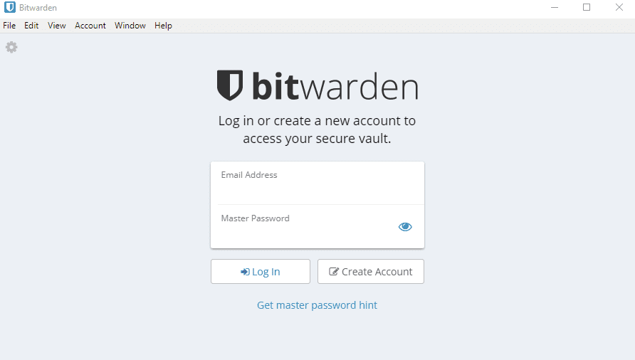

Installing Bitwarden
==================

Bitwarden is a password manager that works on most operating systems. You can easily store your passwords and keep them synced between all of your devices.

Bitwarden stores your logins in an encrypted vault. Since it's encrypted not even Bitwarden's employees can access your logins, only you can access them. Your data is sealed with AES-256 bit encryption, salted hashing, and PBKDF2 SHA-256.

One other advantage of Bitwarden in comparison to password managers like LastPass is that it's open source.

We will cover installing Bitwarden on Linux, macOS and Windows.

Installing Bitwarden on Linux
-----------------------------

To install Bitwarden on Linux we have to visit Bitwarden's download page. To do this go to this webpage: https://bitwarden.com/#download

Click on Linux and download the file. The file's format is .AppImage

AppImage works on all linux distributions.

First navigate to the directory that contains the file. To run this file, you need to update the file's permission. You can do this via terminal.

	sudo chmod +x Bitwarden-*-x86_64.AppImage

Now to run Bitwarden, run this command:

	./Bitwarden-*-x86_64.AppImage

After running Bitwarden for the first time, you'll see a window like this:

Installing Bitwarden on macOS
-----------------------------

To install Bitwarden on macOS we have to visit Bitwarden's download page. To do this go to Bitwarden's download page.

Click on macOS and the installation file will pop up. If you want more options click on 'more desktop installation options'.
After the installer is downloade, install it like any other dmg file.

You can also go to iTunes and install Bitwarden from there.

Installing Bitwarden on Windows
-----------------------------
To install Bitwarden on macOS we have to visit Bitwarden's download page. To do this go to Bitwarden's download page.

Click on Windows and the installation file will pop up. If you want more options click on 'more desktop installation options'.

When the download is finished, run the installer and follow the instructions to complete the installation. When you run Bitwarden for the first time you'll see a window like this.

