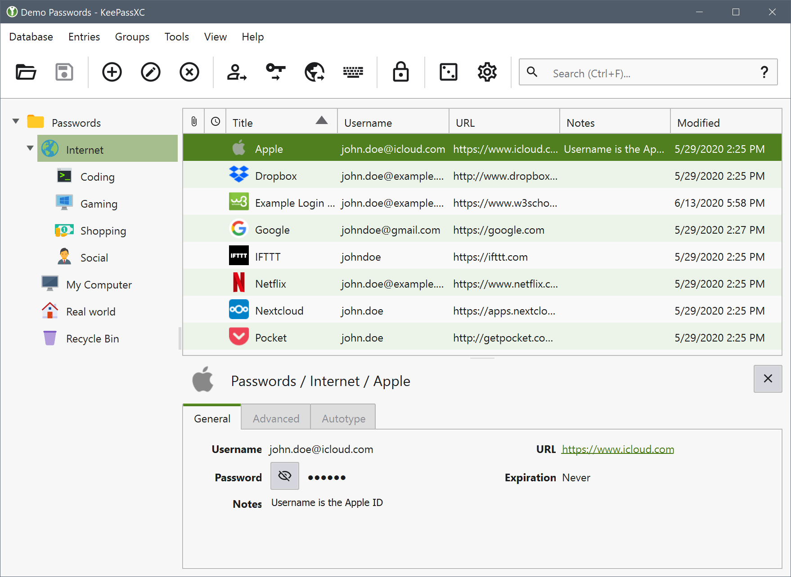
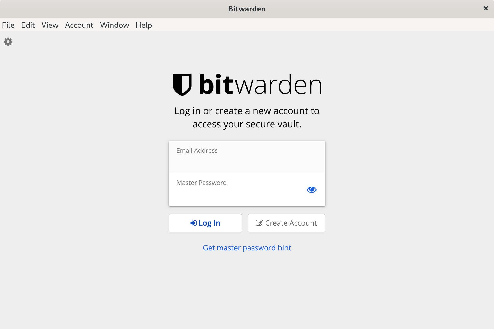
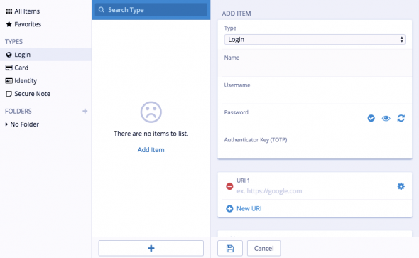
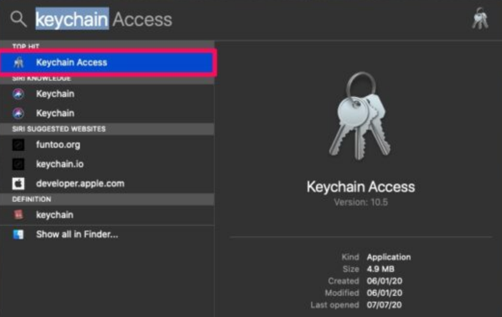

Encrypting Passwords with a Password Manager
============================================

We covered how to install KeePassXC and Bitwarden on your system. Now it's time to create your database. The basic principle is the same; you have a file on your computer which is encrypted with *one single very secure password*. This is sometimes referred to as a 'Master Password', 'Admin-Password', 'Root-Password' etc. but they are all *the ultimate key* to all your other keys and secure data. For this reason you can't and shouldn't think to light about creating this password.

If a password manager is part of your OS (like it is with macOS) it unlocks automatically for you after you login to your account and so opening secure information like passwords. For this, and other, reasons you should disable 'Automatically Login'. When you start-up your computer you should always have to login and, even better, set your computer to automatically log out or lock the screen after a set amount of time.

Encrypting Passwords with KeePassXC
--------------------------------------------

First open KeePassXC from the Applications menu. The first time you use KeePassXC you need to set up a new database to store your passwords. Click on the Database menu and select “New Database.”

Choose a name for your database and click Continue.

Here you can change settings of your database. You don't need to change anything on this screen. If you decided to modify the decryption time and use a higher value to have more protection, be aware that it will take longer to decrypt. After your'e finished, click Continue.

You will be asked to set a master key (password). Choose a strong password for this field - refer to the chapter about passwords if you would like some tips on how to do this. Enter the password and press "Done". If the passwords are the same you will see a new KeePassXC 'database' ready for you to use. (A) is used to open the password generator and (B) is used to toggle password visibility.

It's vital to remember this password since loss of password could result in permanent locking of your database therefore you won't be able to retrieve your passwords.

Now you're ready to use your database. Enter the password to unlock your database.

Now you have a place to store all your passwords and protect them by the 'master' password you just set. You can create as many entries as you wish. To do so go to Entries and choose New Entry. Enter your username and generate a unique and complex password for your account.

KeePassXC gives some indication if the passwords you are using are 'strong' or 'weak'. As may be obvious, you should try to use stronger passwords. For advice on this see the chapter on creating good passwords.

When you want to access the passwords you must then open KeePassXC and you will be asked for the master key. After typing this in you can add all your passwords to the database and see all your entries. 

It is not a good idea to have KeePassXC open at all times since anyone could see your passwords if they can access your computer. Instead get into the practice of just opening it when you need it and then closing it again.

Also it's recommended to have multiple backups of your database of different machines so if anything happened to your machine, you would be able to retrieve your passwords.

Encrypting Passwords with Bitwarden
--------------------------------------------

Launch Bitwarden and you'll see a window like this:

To create your vault, you need to create an account. Click on "Create Account" 

Fill in your email and choose a strong password. You can always refer to the chapter about passwords if you would like some tips on how to do this.

Make sure you've memorized the password. There is no way to recover the password in the event that you forget it.

When you have entered all the necessary information, you’ll see a login window. Now log in to your vault and you'll see something like this:

You can create new entries by clicking on '+' icon. Create unique and complex passwords for each account. If there is a data leak your adversary won't be able to use that password to log in into your other accounts. Each time you change your entries or add a new entry your database will be updated and synced between all of your devices.

Encrypting Passwords with Keychain on macOS
--------------------------------------------

macOS comes pre-installed with a password manager called 'Keychain'. Because of it's tight integration with the OS most of the time you will hardly know it exists. But every now and then you will have a pop-up window in almost any application asking 'do you want to store this password in your keychain?'. This happens when you add new email accounts to your mail client, login to a protected wireless network, enter your details in your chat client, etc.

Basically what happens is that macOS offers you to store all that login data and different passwords in an encrypted file which it unlocks as soon as you login to your account. You can then check your mail, login to your WiFi and use your chat client without having to enter your login data all the time over and over again. This is a fully automated process, but if you want to see what is stored where and alter passwords, or lookup a password you will have to open the Keychain program.

You can find the Keychain program by searching "Keychain Access" in the search field.

Click on File and from the drop down menu choose "New Keychain". Choose a name and click on "Create". 

Now you need to enter a password for your keychain. Remember to choose a strong password.

If you use iCloud, you can have iCloud Keychain sync information automatically between your devices and it auto-fills username and passwords on any device you own.

To activate iCloud Keychain on iOS, go to Settings, Tap [Your name] and choose iCloud. Then click on "Keychain". Slide to turn on iCloud Keychain.

On macOS choose Apple menu and then System Preferences. Now click Apple ID and click iCloud in the sidebar.

Now select Keychain. iCloud Keychain is now activated on your machine.

