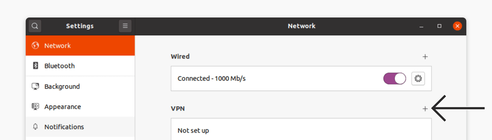
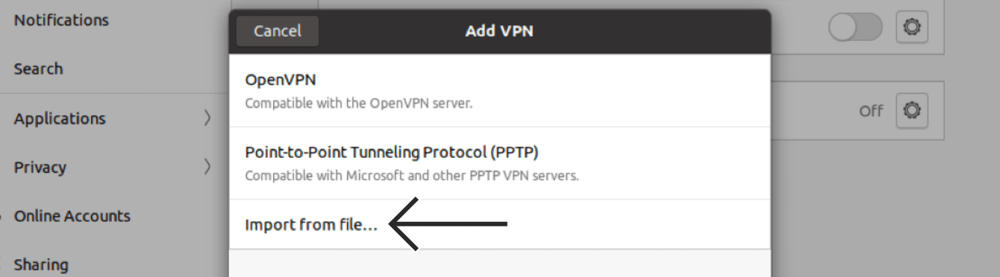

VPN on Linux
=============

If you use Linux as your operating system, you can connect to a VPN by using the built-in *Network Manager*. This application is able to set up networks with OpenVPN. PPTP should not be used for security reasons. Unfortunately at the time of writing a L2TP interface is not available in Ubuntu. (It can be done manually, but it goes beyond the scope of this document).

The following example will explain how to connect with an OpenVPN-server. Under all situations we assume you already have a VPN account as described earlier in this section.

Preparing Network Manager for VPN networks
------------------------------------------

For Linux there is an excellent network utility: Network Manager. This is the same utility you use to set up your Wireless (or wired) network and is normally in the upper right corner of your screen (next to the clock). This tools is also capable of managing your VPNs, but before it can do so, it's necessary to install some extensions.

### Installing and Configuring OpenVPN

To install the plugins for Network Manager we will use the terminal.

 1. Launch a terminal window and type this:

 		sudo apt-get install openvpn network-manager-openvpn network-manager-openvpn-gnome

 2. After the installation, go to settings and select "Network". Next to VPN there is a '+' icon. Click on it.
 
 

 3. A window like this will launch. click "Click Import from file…"

 

 4. Let us assume you have received your configuration files and credentials from your VPN provider. In most cases your provider will send these files to you in a zip file. Select the configuration file and if you need to enter any details enter them. 
 
 5. Congratulations! Your VPN connection is ready to be used and should appear on the list of connections under the VPN tab. Toggle the profile to turn it on. Once connected, you'll see an icon like this:
  
 
 

Final Note
------------------------------------------

Don't forget to perform a leak test. Look at "Make Sure It Works" to ensure your traffic is encrypted. Some VPN providers provide their own client. If it's open source and it has been audited you can use that as well. WireGuard is also a nice alternative to OpenVPN and you should consider using that as well.
