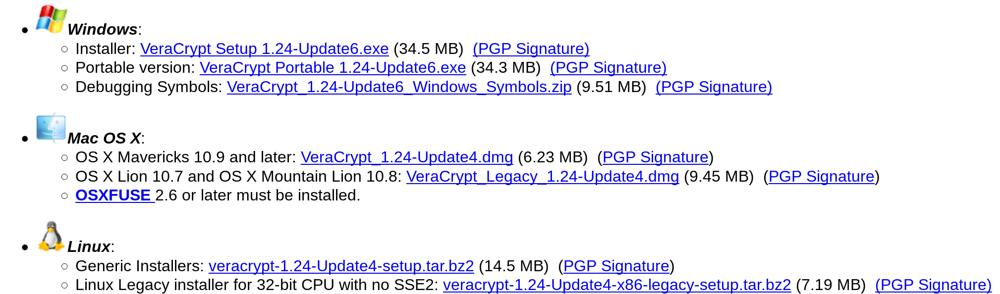
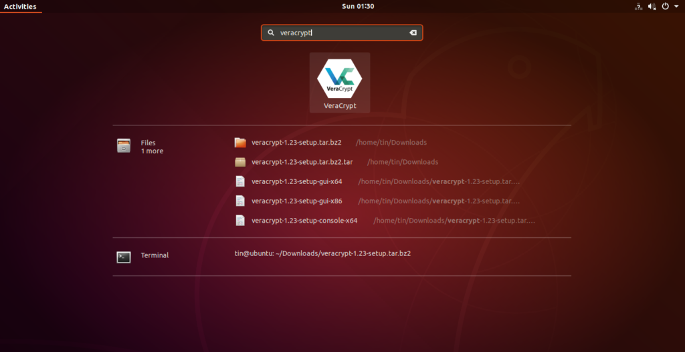
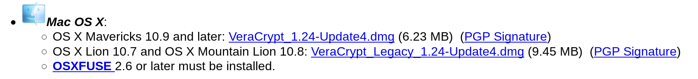
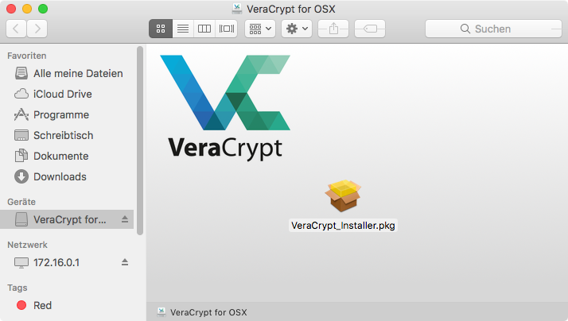
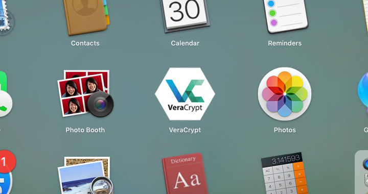
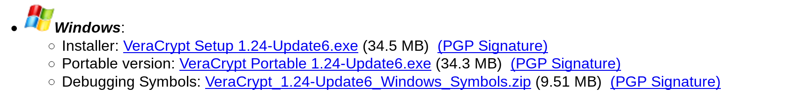

Installing VeraCrypt
====================

VeraCrypt is a utility used for on-the-fly encryption. It can be used to create a virtual encrypted disk within a file or encrypt a partition or the entire storage device with pre-boot authentication. VeraCrypt is a fork of the discontinued TrueCrypt project.

VeraCrypt can be installed on Windows, macOS and Linux. The following three sections give complete details on how to install VeraCrypt for each of these operating systems.

Installing VeraCrypt on Linux
---------------------------

VeraCrypt can be downloaded from the official website. The installation files are available [here](https://www.veracrypt.fr/en/Downloads.html](https://www.veracrypt.fr/en/Downloads.html).

Once downloaded, open your terminal and and run these commands:

	mkdir veracrypt

	tar xjvf veracrypt-1.19-setup.tar.bz2 -C veracrypt

Then navigate into the veracrypt directory. You can do this by using cd command.

	cd veracrypt

Now to run the 64-bit installer. Type this in terminal:

	./veracrypt-1.24-Update4-setup-console-x64

If you downloaded 32-bits installer then you have type this in your terminal: 

	./veracrypt-1.24-Update4-setup-console-x86

Once the installer runs, you are prompted to choose the installation option. Select option 1 to install VeraCrypt.

In the end, you will be asked if you agree with the license. If so, type “yes” and press enter. Then, to start the installation you will be asked for the user password.

Then, wait for the installation to finish. To run it, type veracrypt into the terminal and press enter.

	veracrypt

Another way to launch VeraCrypt is by using Dash menu and typing 'veracrypt' in the search field.

Installing on macOS
-----------------

 1. To install VeraCrypt first visit the download page [https://www.veracrypt.fr/en/Downloads.html](https://www.veracrypt.fr/en/Downloads.html) and download the latest release for macOS.
 
 

 2. Install VeraCrypt using the .dmg file.

 

 3. Open the installation package, and click through the dialogues.

 5. After the installation finishes you can find the program in your 'Applications' folder.

 

Installing on Windows
---------------------

To install VeraCrypt on Windows first visit the download page ([https://www.veracrypt.fr/en/Downloads.html](https://www.veracrypt.fr/en/Downloads.html)) and press the download button under the Windows section.

Download this to your computer and then double click on the file to run the installer. select the “Install” option. You can keep all the default settings in the installer—just click through it until VeraCrypt is installed on your computer.
Now proceed to the chapter on Using VeraCrypt.
