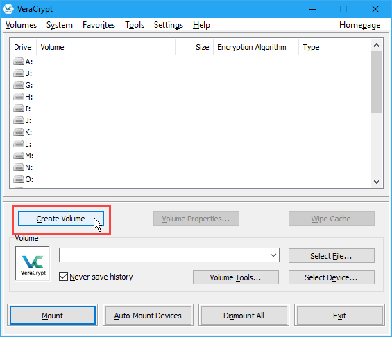
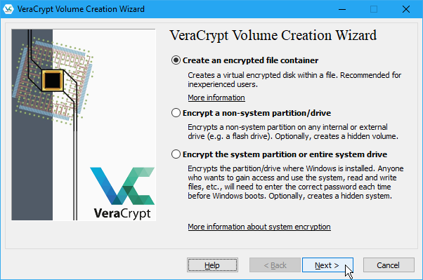
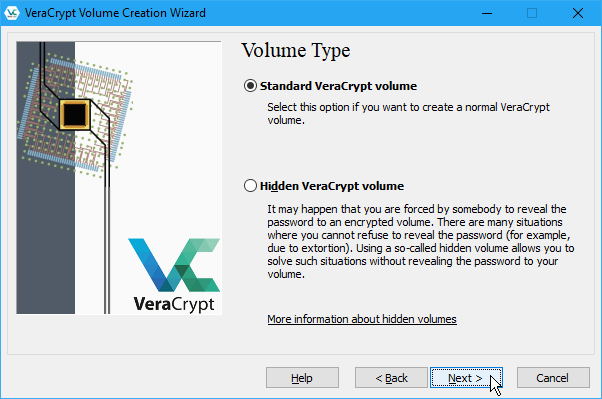
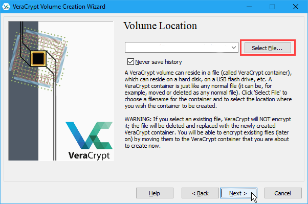
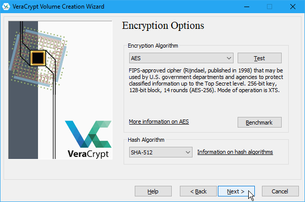
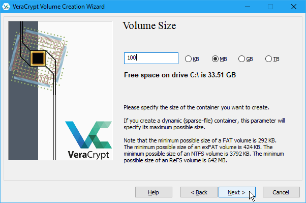
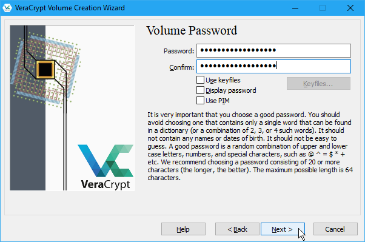
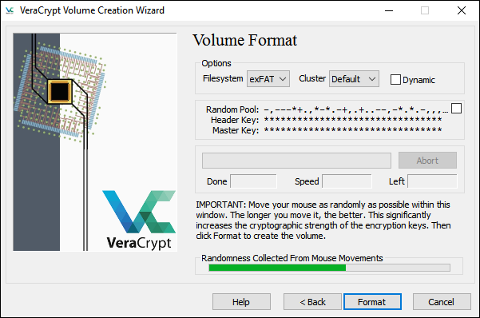
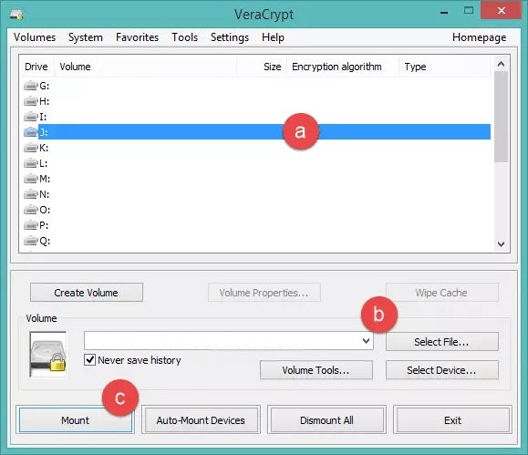
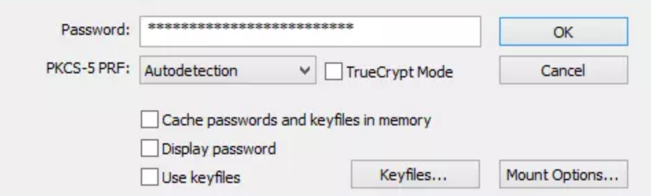

Using VeraCrypt
===============

The following are step-by-step instructions on how to create, mount, and use a VeraCrypt volume.

Creating a VeraCrypt Container
------------------------------

Now that VeraCrypt is installed on your system, launch it. When the main VeraCrypt window appears. Click Create Volume.

You should see the VeraCrypt Volume Creation Wizard window appear on screen.

 
Where do you want to create the volume? You need to choose now. This can be in a file, which is also called a container, in a partition or drive. The following steps will take you through the first option creating a VeraCrypt volume within a file.

You can just click Next, as the option is selected by default,

Next you need to choose whether to create a standard or hidden VeraCrypt volume. We will walk you through the former option and create a standard VeraCrypt volume.

Hidden volume is useful when you when you're forced by somebody to reveal the password and you want to resolve the situation without revealing the password.

 
You can just click Next, as the option is selected by default.

Now you have to specify where to have the VeraCrypt volume (file container) created. Note that a VeraCrypt container behaves like any normal file. It can be moved or deleted as any normal file.

When you're finished, click on the "Next" button.

Now choose an encryption and hash algorithm. If you're not sure what to use, don't change the default algorithms. You can find more information about each setting in VeraCrypt's documentation.

Here we have to choose the size of our container:

 

You may, of course, specify a different size. After you type the desired size in the input field, click Next.

This step is really important, choosing a password. The information displayed in the Wizard window about what is considered a good password, should be read carefully.

Choose a strong password, type it in the first input field. Then re-type it in the input field below the first one.

 

"Use keyfiles" provides more protection. You can enable it if you want to.

Now you must choose the format of your partition. After that move your mouse as randomly as possible. This will increase the cryptographic strength of the encryption keys.

 

When enough randomness is generated, click on the "Format" button.

VeraCrypt will now create a file in the folder you selected with the name you chose. This file will be a VeraCrypt container, containing the encrypted VeraCrypt volume. 

Mounting the Encrypted Volume
-----------------------------

Open up VeraCrypt again.

Make sure one of the 'Slots' is chosen (it doesn't matter which one you choose). Click Select File.

 

The standard file selector window should appear. In the file selector, browse to the container file (which we created earlier) and select it.

In the main VeraCrypt window, click Mount. Password prompt dialog window should appear. Type the password in the password input field.

 

When you're done, Click OK in the password prompt window.

VeraCrypt will now attempt to mount the volume. If the password is correct, the volume will be mounted.

If the password is incorrect (for example, if you typed it incorrectly), VeraCrypt will notify you and you will need to repeat the previous step (type the password again and click OK).

What does this mean?
--------------------

The disk that you have just created is completely encrypted and behaves like a real disk. Saving (moving, copying, etc) files to this disk will allow you to encrypt files on the fly.

You'll be able to open a file which is stored on a VeraCrypt volume, which will automatically be decrypted to RAM while it is being read, and you won't need to enter your password each time. You'll only need to enter this when your mounting the volume.

Remember to dismount!
---------------------

To do this right click on the drive and select unmount. This will automatically happen when you turn off your computer but will not happen if you just put the computer on sleep.
