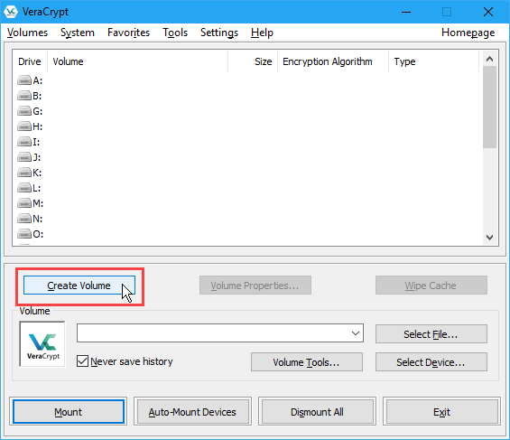
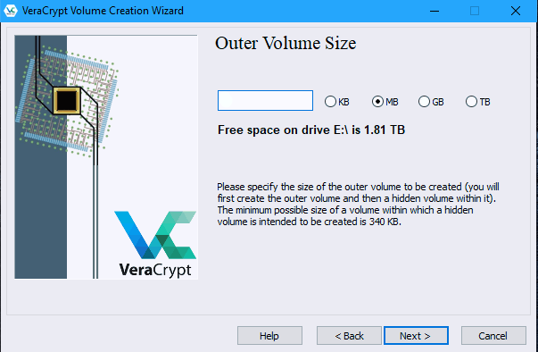
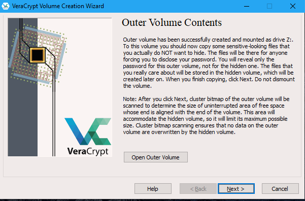
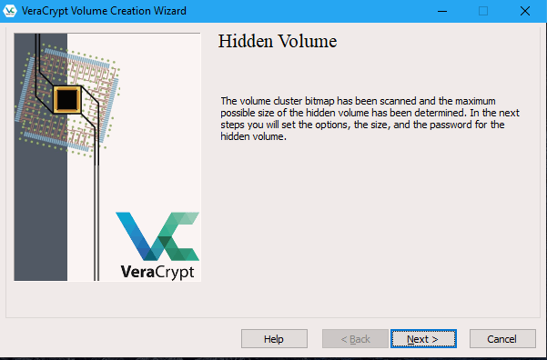

Setting up a hidden volume
==========================

A VeraCrypt hidden volume exists within the free space of a typical VeraCrypt volume. Given then the 'outer volume' is accessed it is (almost) impossible to determine if there is a hidden volume within it. This is because VeraCrypt *always* fills the empty space of an encrypted volume with random data. So a hidden volume looks the same as an empty VeraCrypt volume.

To create and use a hidden volume you need two passwords - one each for the outer and inner (hidden) volumes. When you mount (open) the volume you can use either password and that will determine which of the two is opened. If you want to open just the hidden volume you use one password, and if you want to access just the non-hidden encrypted volume you use the other password.

To create a hidden volume launch VeraCrypt and press the 'Create Volume' button:

The options for half of this process are almost the same as for setting up a standard VeraCrypt volume and then the process continues for setting up the hidden volume but lets go through the entire process step by step anyway. In the screen shown below you just want to stay with the default setting 'Create an encrypted file container':

Press 'Next >' and continue to the next screen.

In the below screen choose the second option which is 'Hidden VeraCrypt Volume'. Select this and click on 'Next >' you will then be asked to choose the location and name of the VeraCrypt *outer* volume.

Click 'Select File...' and browse to a location for a new VeraCrypt volume. It's the same name as we used in the last example so be aware that if you have just followed those instructions you must now create a new volume with a new name.

When you are finished, click on 'Save'. The file browser will close and you return to the Wizard. Click 'Next >'. Here you are presented with some very technical choices. Don't worry about them. Leave them at the defaults and click 'Next >'. 

The next screen asks you to determine the size of the outer volume. Note that when you do this the maximum inner 'hidden' volume size is determined by VeraCrypt. This maximum size will of course be smaller that the size you are setting on this screen. If you are not sure what the ratio of outer volume size to inner (hidden) volume size is then go through the process now as a 'dummy' run - you can always trash the encrypted volume and start again (no harm done).

So choose the size of the outer volume, remember that the minimum possible size is 340 KB.

You cannot set the outer volume size to be larger than the amount of free space you have available on your disk. VeraCrypt tells you the maximum possible size in bold letters so create a volume size smaller than that. Then click 'Next >' and you will be taken to a screen asking you to set a password for the outer (hidden volume comes later) volume.

Enter a password that is strong (see the chapter on creating good passwords) and press 'Next >'. Next VeraCrypt wants you to help it create the random data it will fill the volume up with. So wave your mouse around, browse the web, and do whatever you want for as long as you can. When you feel VeraCrypt should be happy then press 'Format'. 

You can open the outer volume if you like but for this chapter we will skip that and go ahead to create the hidden volume. Press 'Next >' and VeraCrypt will work out how the maximum possible size of the hidden volume.

 
When you see the below screen just press 'Next >'.  After this screen you must choose the encryption type for the hidden volume. Leave it at the defaults and press 'Next >'.

Now you will be asked to choose the size of the hidden volume.

 

When you have set your maximum size press 'Next >' and you will be prompted to create a password for the hidden volume.

When creating the password for the hidden volume make sure you make it substantially different from the password for the outer volume. If someone really does access your drive and finds out the password for the outer volume they might try variations on this password to see if there is also a hidden volume. So make sure the two passwords are not alike.

Enter your password in the two fields and press 'Next >'. 

Leave this window at the defaults and press 'Next >' and you will be presented with the same screen you have seen before to generate random data for VeraCrypt. When you are happy click 'Format' and you should see the following :

Click 'OK' and exit VeraCrypt. You can now mount the volume as noted in the previous chapter. If you want to learn more about hidden volumes, look at VeraCrypt's documentation.
 
