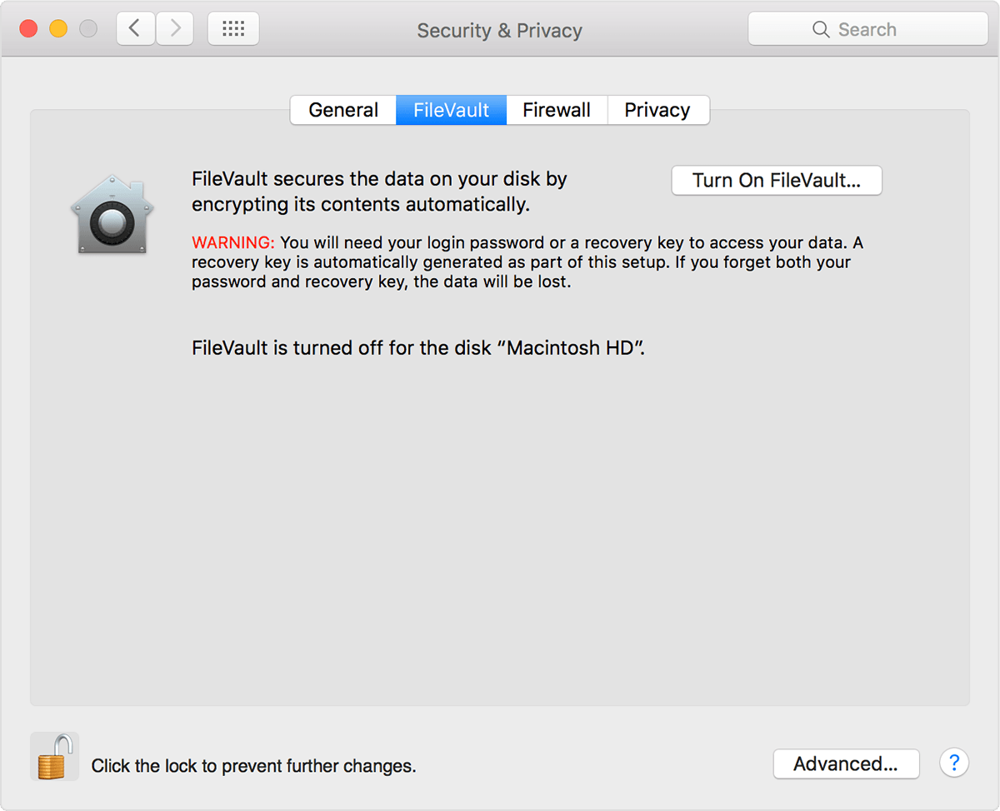

FileVault
===

FireVault is an utility that lets you encrypt your startup disk.  Firevault encrypt all of your data on-the-fly and doesn't let an unauthorized person access your data. FireVault uses 128-bit AES encryption.

Enabling FireVault is very easy and straightforward. To Enable FireVault go to System Preferences > Security & Privacy > FireVault

Now in this tab you can enable FireVault by clicking on "Turn On FireVault...". Encrypting your disk may take a while.

