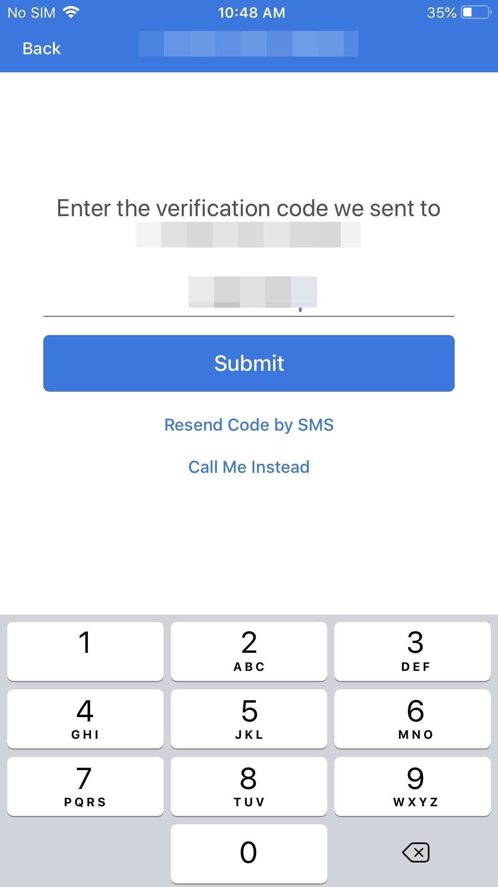
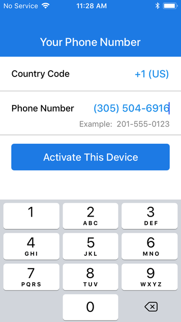
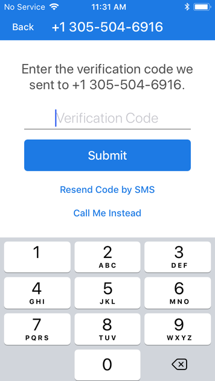

Setting up Encrypted Instant Messaging
======================================

Making secure and private communications with our friends and colleagues is important. In the recent years many providers are trying to advertise their product as private and secure. Using a service that uses end-to-end encryption protocol is recommended since providers can't read your messages.

One other important factor to consider is using an application that is open source. Being open source has the advantage of being transparent. Other developers could audit the app and check for vulnerabilities.

Some products may use strong encryption but if their software is closed source, there might be a backdoor so find an alternative.

Remember that using an encrypted communication doesn't hide the fact that you're communicating with another person, it just hides the content of your communication from other people.

What is Signal?
---

Signal is an instant messaging, voice calling and video calling app that uses end-to-end encryption to encrypt all communications therefore it's very difficult for a third-party to intercept your communications.

Why Signal?
---

If you want to communicate with someone, it is far easier to use an application such as Signal. Compared to Signal, PGP is not friendly for beginners.

Misconfiguration in PGP can lead to unsecure communication as well but since using Signal is fairly easy, you don't have to worry about misconfiguration. Just install the app and use it for your communications.

Signal is also open source and free and it has been audited and probed by security researchers.

Android - Installing Signal
------------------------------

To install Signal on your Android device, open Google Play Store and search for "Signal". After the installation, launch Signal.

When you launch Signal for the first time it asks for your phone number. Enter your phone number. If you don't want to use your personal number create a virtual number and use that.

Signal will send you a verification code. Enter that code to verify your phone number. You will be asked to choose a profile picture and profile name.                                                                                                                                                                                                                                                                                                                                                                                                                                                                                                                                                                                                                                                                                                                                                                                                                                                                                                                                                                                                                                                                                                                                                                                                                                                                                                                                                                                                                                                                                                                                                                                                                                                                                                                                                                                                                                                                                                                                                                                                                                                                                                                                                                                                                                                                                                                                                                                                                                                                                                                                                                                                                                                                                                                                                                                                                                                                                                                                                                                                                                                                                                                                                                                                                                                                                                                                                                                                                                                                                                                                                                                                                                                                                                                                                                                                                                                                                                                                                                                                                                                                                                         

Now you're ready-to-use Signal.                                                                                                                                                                                                                                                                                                                                                                                                                                                                                                                                                                                                                                                                                                                                                                                                                                                                                                                                                                                                                                                                                                                                                                                                                                                                                                                                                                                                                                                                                                                                                                                                                                                                                                                                                                                                                                                                                                                                                                                                                                                                                                                                                                                                                                                                                                                                                                                                                                                                                                                                                                                                                                                                                                                                                                                                                                                                                                                                                                                                                                                                                                                                                                                                                                                                                                                                                                                                                                                                                                                                                                                                                                                                                                                                                                                                                                                                                                                                                                                                                                                                                                                                                                                                                                 

iOS - Installing Signal
---------------------------

To install Signal on your iOS device, open App store and type "Signal" in the search field. Select the app **Signal - Private Messenger** by **Open Whisper Systems**.

Install the app. Once Signal is installed on your device, launch it.

Signal requires a phone number. Your phone number will act as an id so other people can find you and contact you. If you don't want to use your personal number, create a virtual number and use that number.

After typing your phone number click on "Activate This Device".

Now you have to verify your phone number. Enter the code you received.

After submitting your verification code, Signal will request permissions and you can choose a profile name and photo.

Using Signal is straightforward. You just have to choose the contact you wish to communicate with and talk with him/her.

Using Signal on Desktop
---

Before installing Signal on your desktop, know that your machine may be compromised. A keylogger on your machine could log your keystrokes. If machine is infected, a secure messenger can't protect you.

Linux - Installing Signal
--------------------------

Follow these steps:

1. Go to [Signal's download page](https://signal.org/download/). 

2. Click on "Download for Linux".

3. Open a terminal window and type these commands:

		curl -s https://updates.signal.org/desktop/apt/keys.asc | sudo apt-key add -

		echo "deb [arch=amd64] https://updates.signal.org/desktop/apt xenial main" | sudo tee -a /etc/apt/sources.list.d/signal-xenial.list

		sudo apt update && sudo apt install signal-desktop

Remember that to use the Signal desktop app, Signal must first be installed on your phone.

macOS - Installing Signal
-----------------------

Follow these steps:

1. Go to [Signal's download page](https://signal.org/download/). 

2. Click on "Signal for Mac".

3. Download the file and drag it into Applications/

4. Launch Signal and link your device by scanning QR code.

Remember that to use the Signal desktop app, Signal must first be installed on your phone.

Windows - Installing Signal
---------------------------

Follow these steps:

1. Go to [Signal's download page](https://signal.org/download/). 

2. Click on "Signal for Windows".

3. Download the file run the installation file.

4. Launch Signal and link your device by scanning QR code.

Remember that to use the Signal desktop app, Signal must first be installed on your phone.