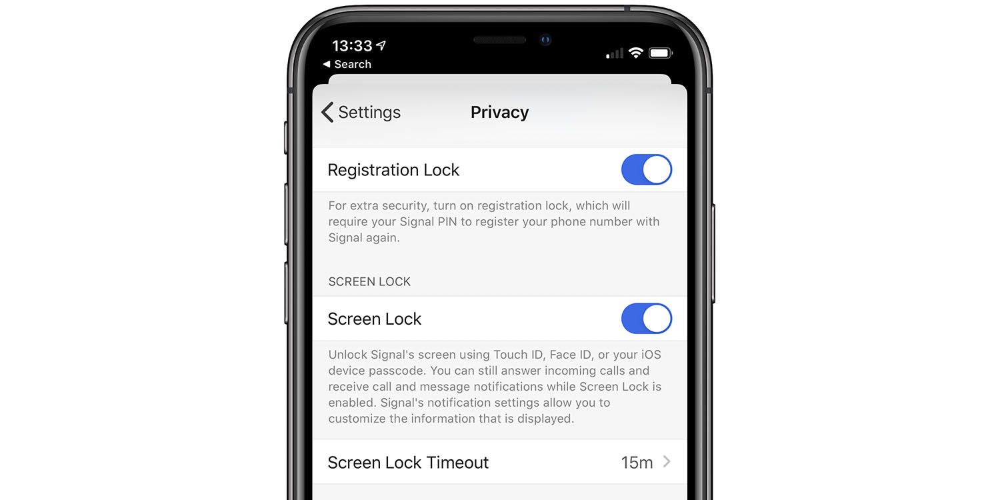
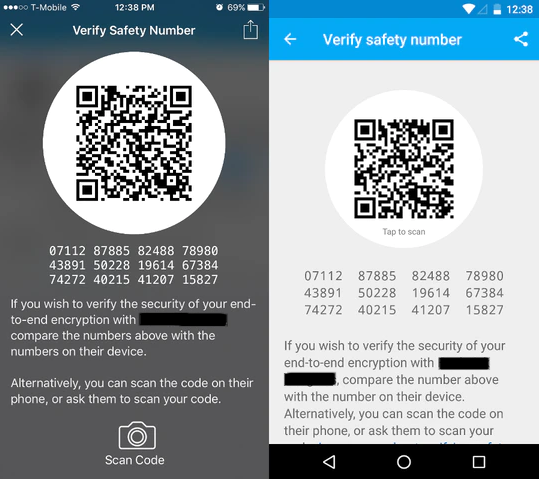
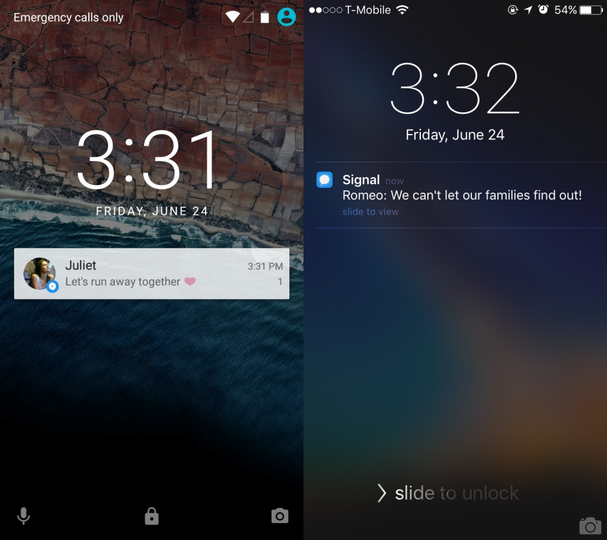
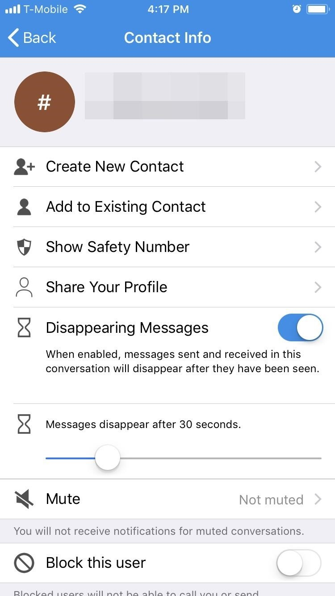

Configuring Signal
---

Although Signal is very private and secure by default, there are some things you can do to improve your security and privacy.

Registration Lock
---
By enabling Registration Lock nobody can hijack your account. This may happen because you didn't use your phone number for a period of time or because you lost your SIM card. Look at this  story: [How I Accidentally Hijacked Someone's WhatsApp](https://www.vice.com/en_us/article/bv8mqd/how-i-hacked-whatsapp-account)

To enable Registration Lock on iOS go to Settings > Privacy > Registration Lock > Enabled

On Android go to Settings > Privacy > Registration Lock > Enabled

Safety Numbers
---

It's important to verify that your session is encrypted with the right person. On iOS click your partner’s name (at the top of the screen) > View Safety Number and on Android click Settings > Conversation settings > Verify safety numbers

Scan QR code in person or on some other channel you consider secure.

If your safety numbers do not match stop communicating.

Notification Privacy
---

If your phone is locked and someone sends you a message, other people may see the content of your message if you haven't changed the notification setting.

To change this on iOS go to Settings > Notifications > Show

On Android go to Settings > Device > Sound & notification > When device is locked.

Disappearing Messages
---

It's good to enable disappearing messages. This feature will remove all messages after a certain period of time. Of course you can change the amount of time.

To do this click on your contact's name.

Screen Lock
---

Screen Lock is useful in case of theft. If a thief stole your smartphone, he is not able to read your messages

To enable Screen Lock on iOS go to Settings > Privacy > Screen Lock

To enable Screen Lock on Android go to Settings > Privacy > Screen Lock

Update Signal
---

Keep Signal up-to-date. Every update will fix security bugs and improve your experience. You'll get new features as well.
