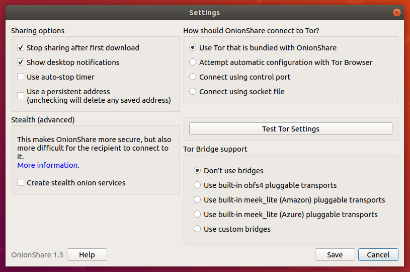
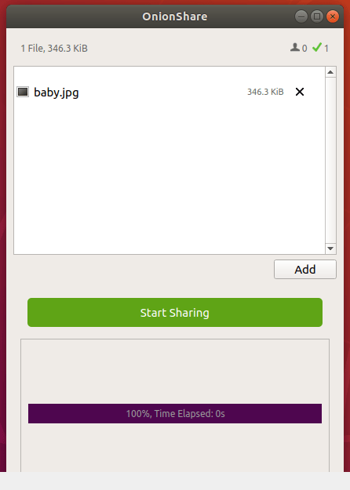

# OnionShare

## Introduction

OnionShare is an open source tool for securely and anonymously sending and receiving files using Tor onion services. It works by starting a web server directly on your computer and making it accessible as an unguessable Tor web address that others can load in Tor Browser to download files from you, or upload files to you. It doesn't require setting up a separate server, using a third party file-sharing service, or even logging into an account.

## Installing on Windows

To download OnionShare for Windows go to [https://onionshare.org/](https://onionshare.org/) to get the latest release for Windows. Packages are always signed by the developer 'Micah Lee'.

To verify the integrity of the package, follow this guide [https://github.com/micahflee/onionshare/wiki/Verifying-Signatures](https://github.com/micahflee/onionshare/wiki/Verifying-Signatures).

## Installing on MacOS

To download OnionShare for MacOS go to [https://onionshare.org/](https://onionshare.org/) to get the latest release for Windows. Packages are always signed by the developer 'Micah Lee'.

To verify the integrity of the package, follow this guide [https://github.com/micahflee/onionshare/wiki/Verifying-Signatures](https://github.com/micahflee/onionshare/wiki/Verifying-Signatures).

## Installing on Linux

If you are using Ubuntu, open a terminal and type:

    sudo add-apt-repository ppa:micahflee/ppa
  
	sudo apt-get update

	sudo apt-get install onionshare

If you re using Fedora open a terminal and type:

	sudo dnf install onionshare

## Using OnionShare

This is what OnionShare looks like when you start it:

You can share as many files and folders as you like. To add them you can use the related buttons or drag&drop files and folders into the window.

Please note the `Stop sharing after first download` checkbox. This ensures the files you share can be downloaded exactly once.

 

Once the hidden service has started copy it's url through the `Copy URL` button.
You now send this address to your friend (through an encrypted channel if necessary).

After receiving the address your friend has to open it in their Tor Browser. It will not work in other browsers.
Your friend sees a link to a zip file and a list of files contained within. Clicking on the big blue button the download is started.

You can see when your friend downloads the files through the blue progress bar. Once everything has been uploaded from your computer OnionShare stops sharing automatically (unless you unchecked the `Stop sharing automatically` button).

To verify that OnionShare really stopped sharing your files you can open the address you sent to your friend in your own Tor Browser. The download is no longer available.

