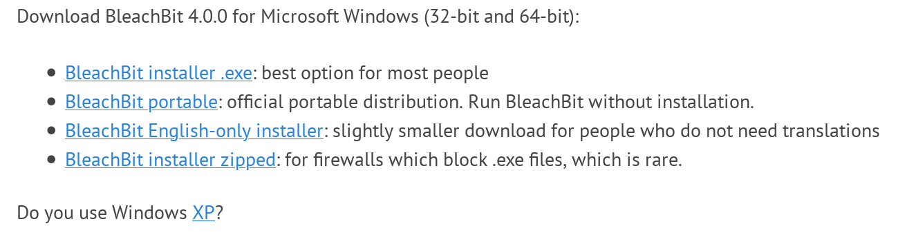
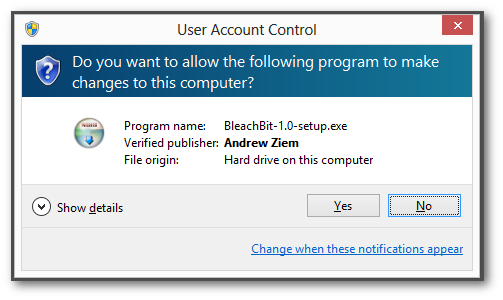
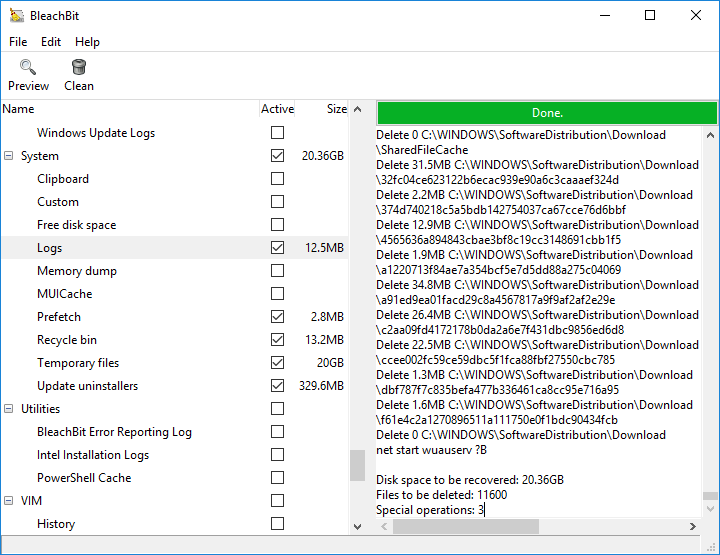
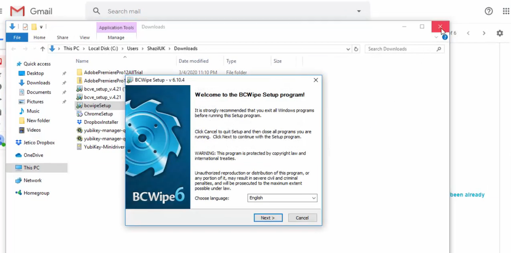
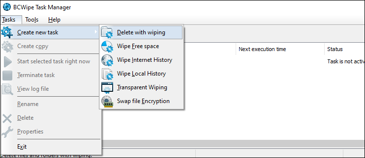
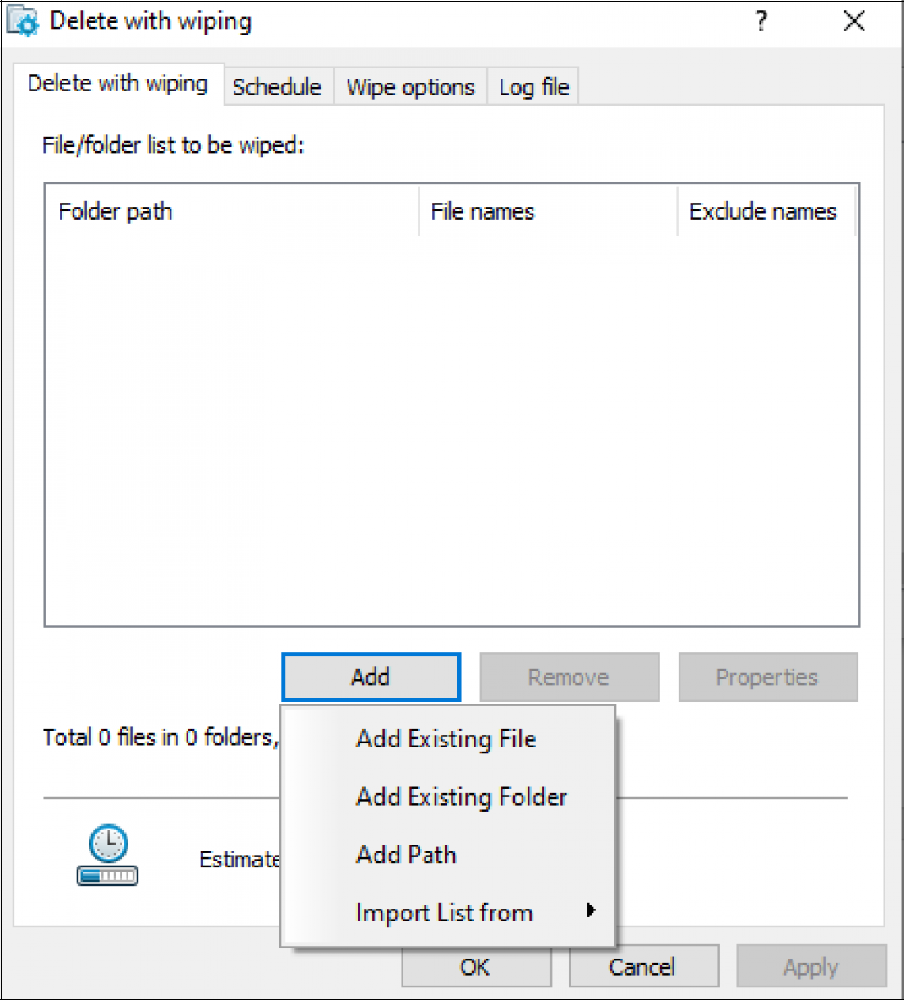
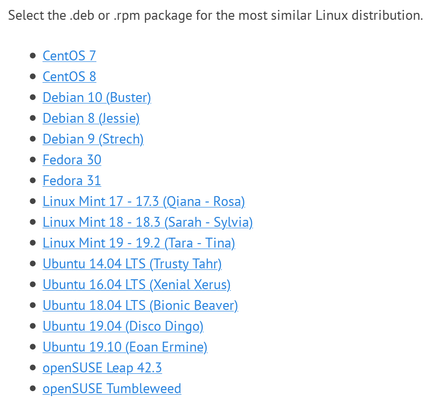
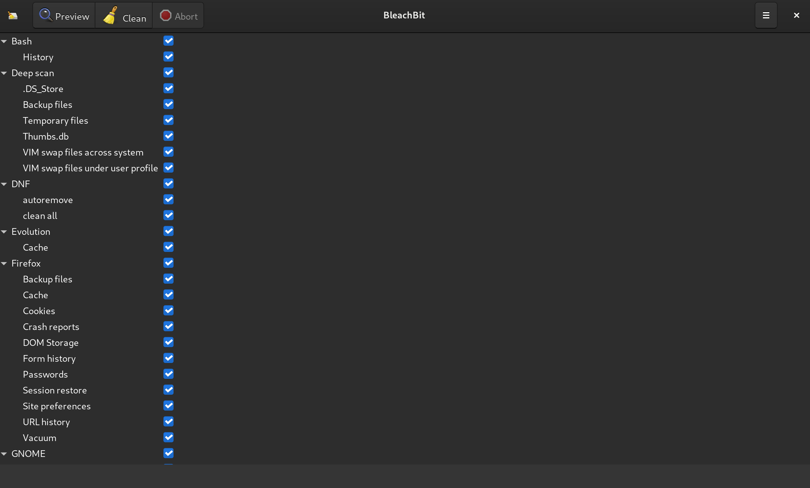
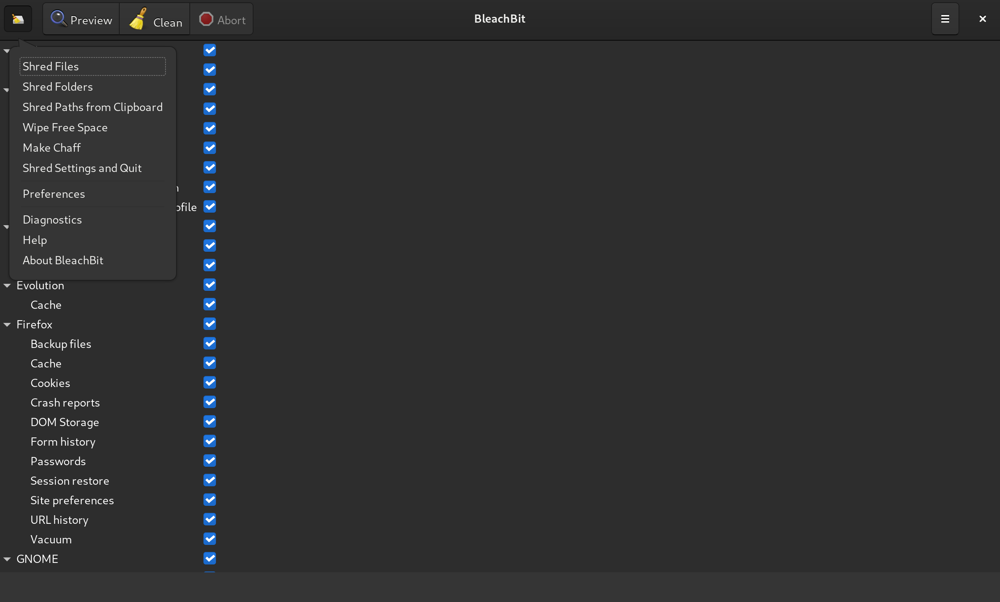

Overwriting
===

One of the best ways to ensure the deleted file is not easy to recover is to overwrite it. By overwriting we write one or zero or a mix of these two on a file. The mix depends on the algorithm as there are various algorithms out there that claim to be the most secure way to delete a file in a secure manner. There is an on-going debate about each of these algorithms and how effective they are on different types of mediums. For example the method suggested by Peter Gutmann does not apply to modern hard drives.

If you think one time overwriting your file is not sufficient enough you can use more passes but for really sensitive files don't rely on overwriting alone. 

Overwriting on Windows
---

For Windows you can use a tool like BleachBit which is open source and was used by Hillary Clinton's campaign or a commerical one like BCWipe which is more professional.

To download BleachBit for Windows go to BleachBit's download webpage at [https://www.bleachbit.org/download](https://www.bleachbit.org/download) and download the appropriate installer for your machine.

After download the appropriate installer, run the installer and you would see a window like this:

Note: before installing the application, verify the installer.

Click 'Yes' and follow the prompts to finish the installation.

When installed, run the application and you'll see a window like this:

On the left side you can see a list of items you can choose from. Choosing all of them will make the deletion process longer. When you're ready click on 'Clean'. 

To delete a specific file or folder we're going to use the shredder. To do this click on 'File' and select either 'Shred File' or 'Shred Folder'. Select the folder or file and and click 'Delete'.

One other option is to use BCWipe. To use BCWipe go to Jetico's download webpage and download the appropriate installer and start the installation process.

Choose 'External License' on License information page and click 'Load license received from vendor'. Enter the license and click on 'Finish' and restart your machine.

Now to delete files using BCWipe click on 'Tasks' and select 'Create New Task' and then select 'Delete with wiping'.

Now click 'Add' and choose the files or folders you want to wipe. 

You can also set a specific time from 'Schedule' tab or choose a specific wiping scheme from 'Wipe options' tab. When you're ready click 'OK' to start the wiping.

Overwriting on macOS
---

You can use BCWipe on macOS. The process for installing and wiping on macOS is similar to Windows so follow the same steps to wipe your files.

Overwriting on Linux
---

Fortunately, there are many tools for Linux that helps you overwrite a file. We discuss some of them here but there are other options as well.

One useful tool we can use to overwrite a file is 'dd' utility. you can also use this utility to wipe a hard drive as well. To overwrite our file with random data we need to know how many characters to write over. This command will show you the byte size:

	$ ls -l

Let's say the file we want to delete is named 'abc.txt' and has 50 bytes. Now if we wanted to use dd, we would use it this way:

	dd if=/dev/urandom of=abc.txt bs=50 count=1 conv=notrunc

Here we used /dev/urandom but you could use another device like /dev/random or /dev/zero 

If you wanted to overwrite your whole hard drive with this device you would type this:

	dd if=/dev/urandom of=/dev/hda

Other utilities such as DBAN are also used for wiping hard drives as well. Look into them and find what's suitable for you.

Other than dd you can use utilities like shred or wipe. There is also a utility called srm which helps you delete files securely. Read the manuals before using them.

### Using Bleachbit

You can use BleachBit is pretty easy and straightforward. Download the appropriate installer from BleachBit's website.

Launch a terminal window and type this if you're using a Debian-based distro:

	sudo dpkg -i bleachbit_*.deb

If you're on Fedora, type this:

	sudo rpm -Uvh bleachbit-*.noarch.rpm

When you launch it for the first time, you would see a window like this:

On the left side you can see a list of items you can choose from. Choosing all of them will make the deletion process longer. When you're ready click on 'Clean'. 

To delete a specific file or folder we're going to use the shredder functionality. To do this click on BleachBit's icon and select either 'Shred File' or 'Shred Folder'. 

Select the folder or file and and click 'Delete'.

### Using BCWipe

BCWipe is a commercial alternative to BleachBit and is considered more professional and it provides different wiping schemes. BCWipe claims that it's software was used by Clinton Administration to remove sensitive data and information from staff computers.

The process for installing and wiping on Linux is similar to Windows so follow the same steps to wipe your files.

