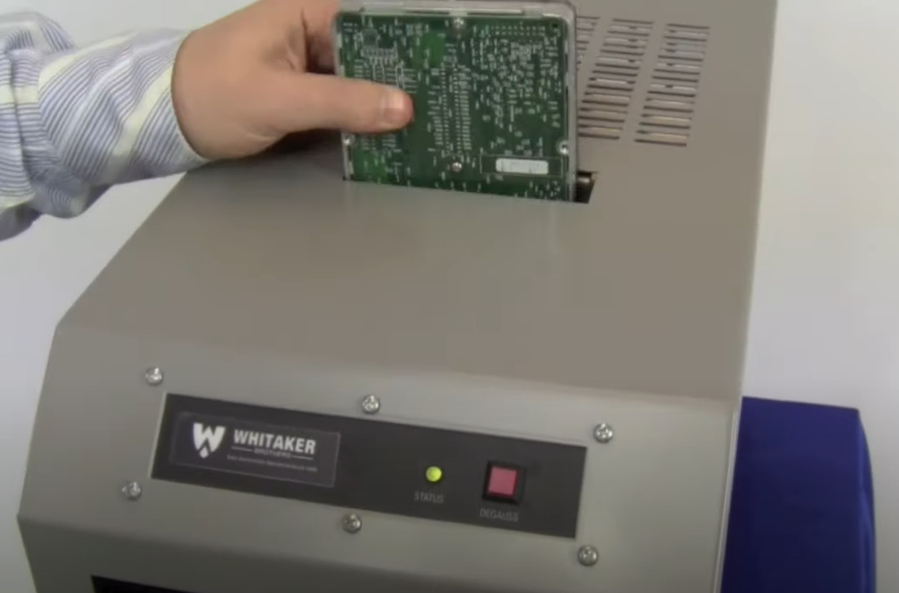

Degaussing
===

Degaussing is one of the methods used to wipe data from a hard drive. This process only works on magnetic storage since it utilizes the power of magnets to delete any form of magnetic digital storage including hard drives, floppy disks or magnetic tape. You can't use a degausser on SSDs or thumb drives because they don't rely on magnets. 

The magnets used by the degausser are very powerful and they rearrange the entire magnetic structure of the drive. When this happens, your data will be wiped completely. This method is very effective and the NSA recommends using a degausser in their manual.

It's critical to use a standard degausser instead of using a cheap magnet to make sure the data is completely gone, 
especially if you're working with sensitive material. Find a company that produces high-quality degaussers that comply with high level standards. 

There are several factors you have to consider before choosing a degausser:

- What are you trying to destroy? Keep in mind that degaussers don't work on SSDs and only work on magnetic storage devices.

- Amount of media to be destroyed: If you don't have many drives to degauss you can use a wand style degausser. Instead of buying a huge machine you can also use a wand style degausser which is portable and would work just as well as the industrial style degaussing machines. 

- Automatic or Manual: If you have many drives, you could use an automatic degausser to degauss your drive in a matter of seconds instead of using a manual degausser which would be more time consuming.

If you don't have the budget to buy a high-quality degausser, you could find a company that let's you use their service for a fee.

After degaussing, the physical appearance of your hard drive won't change at all and the only way to keep track of erased drives is to label them.