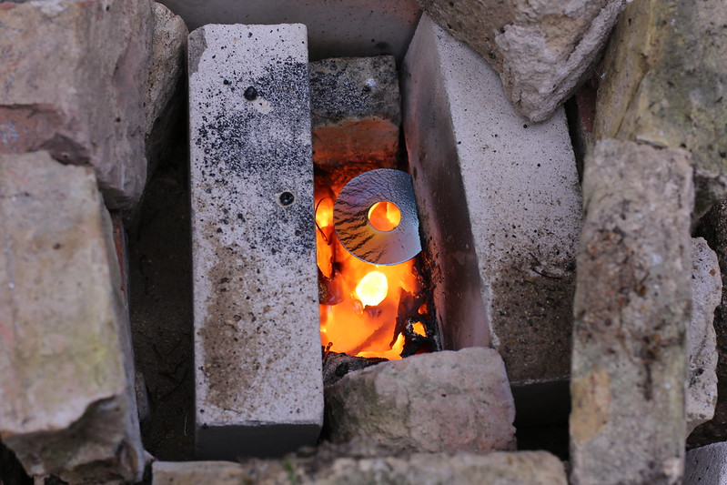

Physical Destruction
===

One effective way to destroy data is to physically destroy the storage media. It's recommended to use the combination of overwriting, degaussing and physical destruction to make sure your data is unrecoverable.

You can physically destroy your storage media but some companies  offer services in this field and since they're more experienced, your data is probably gone after the process but if you don't trust them with your data, you can do it yourself.

There are different methods when it comes physically destroying the storage media. These methods include:

- Crushing: You need a powerful presser capable of generating tons of force. By physically crushing your drive, you'll make it inoperable and the data is completely destroyed. 

	

- Drilling: You could use a high-quality power drill to make punctures right through the hard drive casing and the platters inside. You can also put a nail through the hard drive with a hammer. Be careful and remember to use a face shield. 

	

- Shredding: By shredding you'll turn your drive into small pieces. the size of fragments depends on the shredder used. You need an equipment for shredding. Find a suitable shredder or contact a company that specializes in shredding.

	

- Smashing: Hard drives contain platters and destroying these platters would make the data unrecoverable. Open the hard drive casing and use a hammer to shatter them. Smash them into little pieces and if you think someone might rebuild the disk by piecing them together, Incinerate the drive or use acid on it.

	
	
- Incineration: You should be cautious if you're going to put your hard drive in a fire. There might be an explosion or toxic gas could be produced. Try to stay away and take the necessary safety measures. Other than that this method is very effective.

	
	
- Using acid:
This method is considered dangerous since acid can burn through materials and if it gets on your hand it will cause permanent tissue death. Put the platter in acid and it will dissolve. acid will peel away everything that's of value on the platters.

	

Final note
---

Take the necessary steps to protect yourself from toxic gas or acid or small flying fragments. If you want to burn the media or put it in acid, you should be really careful since the process will produce toxic gas that could be harmful for your health.

You should spend some time reading more about digital forensics and how other people were unable to destroy their storage media effectively and their data was still recoverable. 

Ditching your hard drive in water won't make it unrecoverable since the data is still on  the platters, although modern solid-state drives are more susceptible to water. Your adversary may take the magnetic platter and put it on an undamaged hard-drive chassis of the same make. A broken platter can also be repaired by piecing it together like a cracked plate. Repairing a broken platter would be costly and time-consuming and most people wouldn't bother to recover the data from a shattered platter but if your adversary has the resources and wants the data, there's a possibility they will be able to recover it.

Therefore it's advised to choose a method based on your threat model to protect your data effectively.