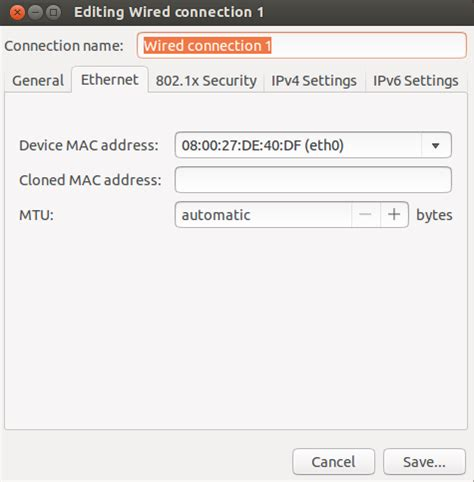
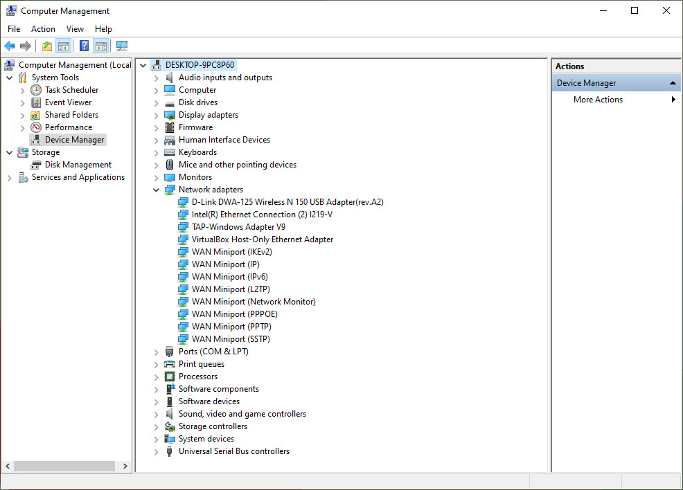
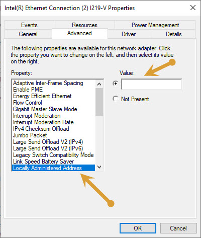
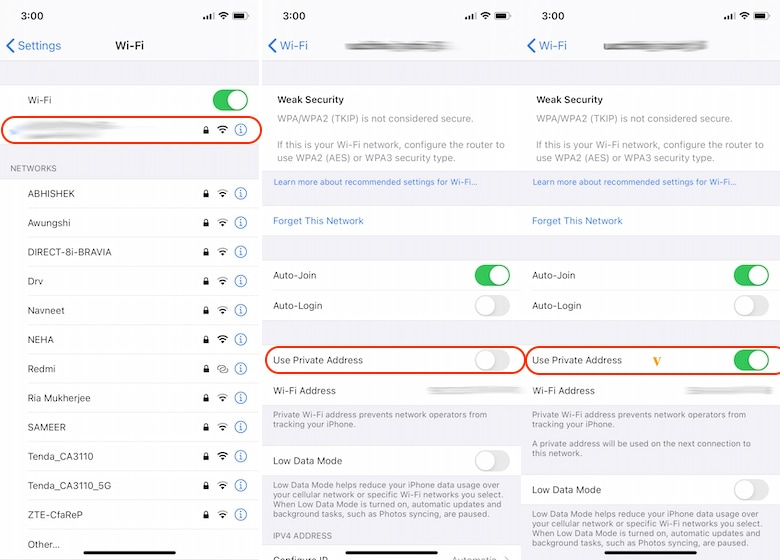
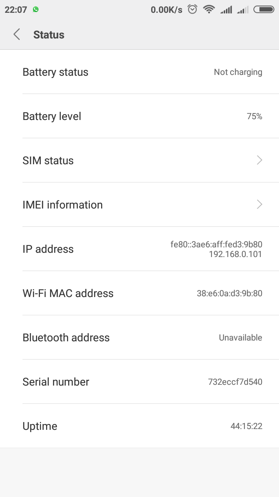

MAC Address
===

Each machine has a unique identifier. This identifier is known as media access control address or MAC address. MAC addresses are primarily assigned by device manufacturers. MAC address is also known as physical or hardware address. This address could be used to identify you.

When you want to use a free network offered by coffee chains or Fast food restaurants you should always change your MAC address since they log every MAC address to identify users.

MAC address spoofing is also popular among college students since colleges block specific MAC addresses to stop accessing the Internet from the network. People change the MAC address to circumvent this issue.

In Tails you have the option to spoof your MAC address when you boot your system. But in other operating systems this doesn't happen automatically unless you write a script that does this process every time you log in. Here we discuss the methods which we can use to spoof our MAC address when we connect to a network.

Spoofing MAC Address in Linux
---

To spoof a MAC address in Linux we can use two methods. Network Manager provides a graphical way to spoof a MAC address.

Click the network icon on the top panel. Click 'Edit Connections' and select the network connection. Then click 'Edit'. Go to Ethernet tab and enter a new MAC address in the 'Cloned MAC address' field, and then save your changes.

Another way of spoofing your MAC address is to launch a terminal window and type this to take your network interface down:

	sudo ifconfig eth0

Type this to change your MAC address:

	sudo ifconfig eth0 hw ether xx:xx:xx:xx:xx:xx

Now to bring your network interface back up, type this:

	sudo ifconfig eth0

To verify your MAC address has changed, run this command:

	ifconfig

If these methods seem complicated to you, there is another utility called macchanger which you can use. Install it and read the documentation to change your MAC address.

Spoofing MAC Address in macOS
---

To spoof your MAC address, you need to launch terminal and type this command:

	sudo ifconfig en0 xx:xx:xx:xx:xx:xx

Replace en0 with the name of your network interface and instead of xx:xx:xx:xx:xx:xx write your desired MAC address. Remember this doesn't spoof your MAC address permanently. You need to this each time your system reboots. Write a script to automate this instead of doing it every time you reboot your system.

Finally type this to verify your MAC address has changed:

	ifconfig

Spoofing MAC Address in Windows
---

To spoof MAC address in Windows open Device Manager.

Select Network adapters and right click on your network adapter then select properties.

Pull up the Advanced options window. Select 'Locally Administered Address' and enter a new MAC address in the value field. When you're done click 'OK'.

 

To verify that your MAC address has been spoofed, launch command prompt and enter:

	ipconfig /all	 

Spoofing MAC Address in iOS
---

In the past it was not possible to spoof your MAC address in iOS without jailbreaking it. Now Apple offers a feature which allows you to change your MAC address when you connect to a network. Go to Settings > Wi-Fi and click the 'i' icon next to the connected network. Toggle on "Private Address" and reconnect.

Spoofing MAC Address in Android
---

If you want to change your MAC address permanently, you have to root your device, but to spoof it temporarily we don't have to root our device.

Follow these steps:

1. Go to Settings > About My Phone. You can see your MAC address on the bottom of screen.

	

2. Type this in your terminal emulator (if you don't have any terminal, install ' Terminal Emulator for Android'). This command  will show you the name of your interface:

		ip link show
	
3. Type this command to change your MAC address:

		ip link set interface name MAC address

Verify your MAC address has changed.