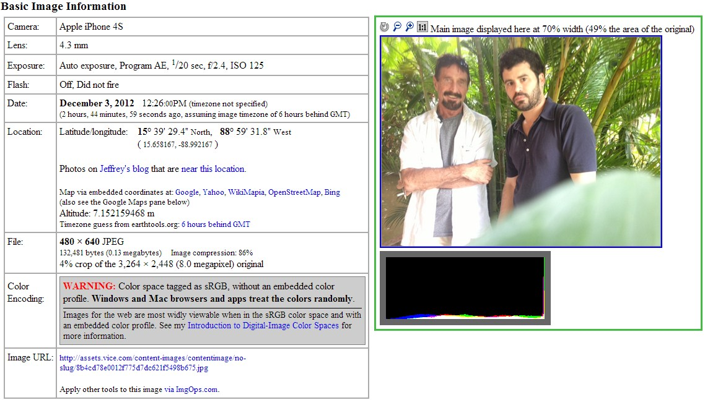
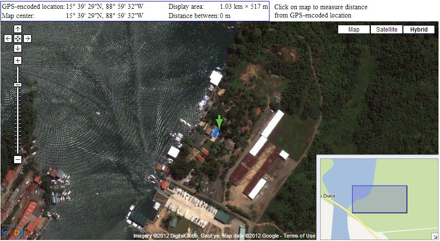
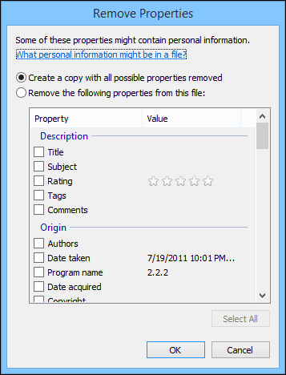
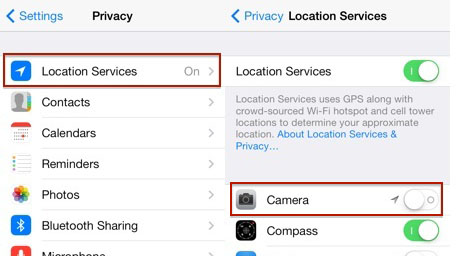
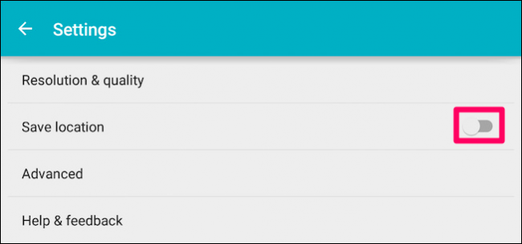

Metadata
--------

Metadata is "data about data". When you're using a service you willingly generate some type of data. You also generate another type of information which you're unaware of. This information is called "metadata". Let's say you're calling your friend Alice and you want to talk about some private subject. Although your communication is encrypted but the service you're using still generates metadata.

Metadata for phone calls includes:

- Alice's phone number

- Time and date of calls and SMS

- Duration of calls

- The location of the nearest cell tower when you sent or received a call or SMS

When you visit a website, you generate metadata as as well. Your IP address and duration of your web connections are logged and stored. The same goes for sending emails. Metadata for emails include:

- Sender and recipient's email address
- Time and date sent
- Subject line

		From: Bob <bob@example.com>
		To: “alice@example.com” <alice@example.com>
		Date: Wed, 11 Jan 2020 14:10:05 -0600
		Subject: My password is: abc123

Some people think that metadata is absolutely useless and it can't be used to identify you, but this is completely wrong.

During a debate with David Cole, Michael Hayden, Former NSA and CIA Director has said that "We kill people based on metadata". NSA reportedly had a Metadata collection program. You can watch the debate here: [https://www.youtube.com/watch?v=kV2HDM86XgI](https://www.youtube.com/watch?v=kV2HDM86XgI).

In the recent years, people have found about the importance of metadata when it comes to de-anonymization. Check out [[1]](https://www.pnas.org/content/pnas/113/20/5536.full.pdf)[[2]](https://www.abc.net.au/news/2015-08-24/metadata-what-you-found-will-ockenden/6703626?nw=0)[[3]](https://www.abc.net.au/triplej/programs/hack/how-team-of-pre-teens-found-whisteblower-using-metadata/8113668).

In this [video](https://www.youtube.com/watch?v=KVY3mq6B-5w), Barack Obama talks about how NSA only monitors your metadata and therefore your privacy is not invaded.

As NSA General Counsel Stewart Baker has said, 'metadata absolutely tells you everything about somebody’s life. If you have enough metadata, you don’t really need content.'

When we look at metadata, it shows a complete map of everyone's life. Let's say you call a sex line at 3 AM and talk for 30 minutes. They don't need to know what you heard or talked about during that call, they know what you did.

Let's say they know that you called a gynecologist and spoke for 15 minutes and then called an abortion clinic’s number an hour later. We can make an educated guess about the subject of that discussion with your gynecologist.

Preventing metadata is very difficult because mobile phone companies need to collect those information as business records and simply encrypting your metadata is not a solution since it must remain unencrypted in order for the systems to operate.

Right now laws cannot protect us against this type of invasion. Learn more about how metadata can be used to identify and track you and try to minimize your metadata as much as possible.

McAfee's Case
---

In one case, John McAfee, the founder of McAfee Antivrius was on the run because he was accused of murder. During that time a reporter from Vice interviewed McAfee posted a picture of John McAfee online.

The guy who took the picture with his iPhone forgot to scrub the metadata. Someone fount out about it and now everybody knew McAfee's location down to longitude and latitude.

Those coordinates suggested that McAfee was in Guatemala. By using Google Maps people were able to see where the picture was taken:

If you're a journalist this could be pose a great risk for your source. It's always recommended to to scrub your files of metadata before sending them to someone or uploading them on the Internet. 

Facebook, Twitter and other sites hide the metadata but they still collect it and they use it for advertising. For example, Imgur a service which allows you to share images states this in their privacy policy:

"We also log the metadata associated with any uploaded images."

Imgur states the collected data is not completely anonymous because advertisers have the ability to identify users and they sell your data to advertisers.

"Some of this information could, however, become personal data because we provide automatically collected anonymous data to third party advertisers to supplement the tracking information described below, and those third parties might be able to combine our anonymous data with other data they have to enable them to identify people."

Scrubbing Files of Metadata in Linux
---

To scrub metadata in Linux, we're going to use Exiftool. Exiftool is an open source tool which let's you analyze and edit metadata. To use Exiftool follow these steps:

1. Go to Exiftool's homepage: https://exiftool.org/
2. Download the file for Linux.
3. Type these commands:

		$ tar xvf Image-ExifTool-10.61.tar.gz
		$ cd Image-ExifTool-10.61/

	Note: Your version may differ. Make sure to check your file.
	
4. To run Exiftool run this command:

		./exiftool

Whenever you want to run Exiftool, type exiftool in your terminal.

This command will show you all the metadata associated with an image.

	exiftool image.png

Now to remove all metadata we can use this command:

	exiftool -all= -overwrite_original photo.jpg

For more options run this:

	man exiftool

Scrubbing Files of Metadata in Windows
---

### Exiftool

To scrub metadata in Windows, we're going to use Exiftool. Exiftool is an open source tool which let's you analyze and edit metadata. To use Exiftool follow these steps:

1. Go to Exiftool's homepage: https://exiftool.org/
2. Download the stand-alone Windows executable.
3. After download the zip file open it and rename it to "exiftool.exe". 
4. Move "exiftool.exe" to the "C:\WINDOWS" directory.

To use Exiftool, type this at the command prompt.

	exiftool

This command will show you all the metadata associated with an image.

	exiftool image.png

Now to remove all metadata we can use this command:

	exiftool -all= -overwrite_original photo.jpg

To learn more about other available options, read the application's documentation.

### An Alternate Way

One other way to check for metadata is to select "Properties". Then click on the "Details" tab.

Here you can see all the metadata. If you want to remove the metadata click the "Remove Properties and Personal Information". 
Choose "Remove the following properties from this file". After that mark beside the properties you may want to remove and select OK.

Scrubbing Files of Metadata in macOS
---

To scrub metadata in macOS, we're going to use Exiftool. Exiftool is an open source tool which let's you analyze and edit metadata. To use Exiftool follow these steps:

1. Go to Exiftool's homepage: https://exiftool.org/
2. Download the MacOS package.
3. Install the package.

To use Exiftool, open a terminal window and type:

	exiftool

This command will show you all the metadata associated with an image.

	exiftool image.png

Now to remove all metadata we can use this command:

	exiftool -all= -overwrite_original photo.jpg

To learn more about other available options, read the application's documentation.

Disable geo-tagging in iOS
---

To disable geo-tagging in iOS go to  Settings > Privacy > Location services and disable "Location Services" for "Camera".

**Note**: Before sending any files, check for metadata.

Disable geo-tagging in Android
---

To disable geo-tagging in Android, open your camera app and click on three horizontal lines.

After that click on the gear icon. Now toggle off "Save Location".

**Note**: Before sending any files, check for metadata.
